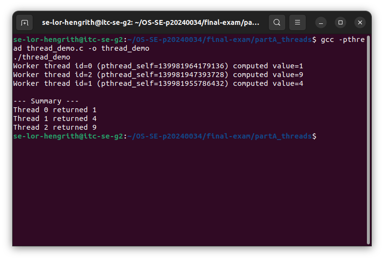
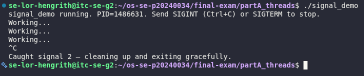
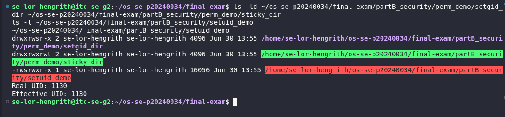
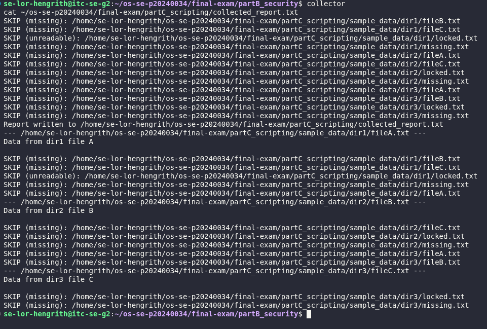
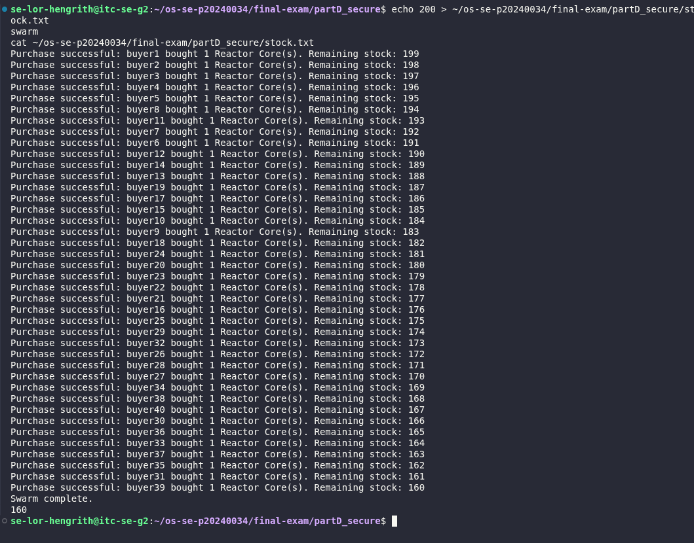
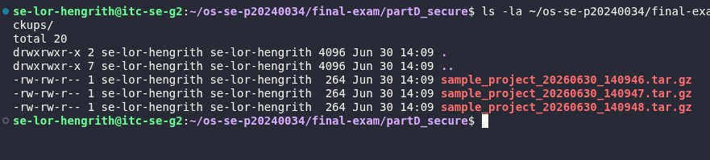

# Final Exam — LOR Hengrith
Student name: LOR Hengrith
Student ID: p20240034
Server username: se-lor-hengrith
Exam scenario value (COMPANY / PRODUCT): NebulaSoft / Reactor Core
Date & start time: 2026-06-30, 13:21
AI assistant used (name/none): Claude

> Exact commands per part are in `commands.md`. Live-curveball answers are in `live_mods.md`.

---

## Part A — Threads, Kernel Mapping & Signals

**Screenshots**

**Written (one short answer)**

- **Why does a worker thread's joined result reach the main thread, but a forked child's value would not?**
  A pthread shares the same address space as the process that created it. When a worker thread heap-allocates a result and returns a pointer to it, `pthread_join()` retrieves that exact pointer into the calling thread's memory — it's all one shared heap. A forked child, by contrast, gets its own copy of the address space (copy-on-write); any value it computes lives in its own private memory and is never automatically visible to the parent. Getting data out of a forked child requires explicit IPC (pipe, shared memory, exit status), not a simple pointer return.

**Anything not completed:** none

---

## Part B — Files, Permissions & Special Bits

**Screenshot**

**Written (one short answer)**

- **Translate your private file's final octal mode into the 9-char symbolic string** (e.g. `600` → `rw-------`).
  octal `600` → `rw-------`

**Anything not completed:** none

---

## Part C — Bash Scripting, PATH & Safe File Scanning

**Screenshot**

**Written (one short answer)**

- **Why did `greeter` fail to run by name before you added your `bin` directory to PATH?**
  Bash only searches the directories listed in the `$PATH` environment variable when resolving a bare command name. `~/bin` wasn't in `$PATH` by default, so typing `greeter` failed with "command not found" even though the script existed and was executable — the shell had no way to locate it without either the full/relative path (`./greeter`) or `~/bin` being added to `$PATH`.

**Anything not completed:** none

---

## Part D — Concurrency, a Race Condition & File Locking

**Screenshot**

**Written (one short answer)**

- **Why did the unpatched `swarm` sometimes leave more stock than the correct final value (with `200` stock and `40` concurrent buyers)?**
  Each buyer process reads the current stock, checks it, then writes back a decremented value — a classic time-of-check-to-time-of-use (TOCTOU) race. With no locking, two or more buyers can read the same stock value before either has written back, so both compute their decrement off the same stale number. The second write overwrites the first, silently losing one of the decrements. With enough lost updates, fewer total decrements get applied than the number of successful purchases, leaving more stock remaining than the correct value (200 − 40 = 160). In my own runs the race was severe enough to also produce negative stock and partial-read errors, since concurrent writes could also corrupt mid-read values — confirming the same unprotected critical section, just an even more visible symptom of it.

**Anything not completed:** none — D2 unpatched runs were highly inconsistent (final stock = -1 across 3 runs, see observations.txt for detail); D3's lock fixed it deterministically to 160.

---

## Part E — Backups, Archiving & cron Automation

**Screenshot**

**Written (one short answer)**

- **Archiving vs compression — which one actually shrank the bytes, and why?**
  `tar` itself only archives — it bundles multiple files/directories into a single `.tar` file without reducing their total size, just removing the overhead of separate filesystem entries. The actual byte reduction comes from the `-z` flag (gzip compression) layered on top, which compresses the bundled archive's contents using DEFLATE. So `tar` solves "many files → one file" while `gzip` solves "fewer bytes" — in `tar -czf`, the `c` (create) + `z` (gzip) combination does both, but it's specifically the compression step that shrinks the bytes.

**Anything not completed:** waiting on the 14:35 one-shot cron entry (cron_oneshot.log) and the 16:00 backup_exam entry to fire before cron_report.txt is finalized.