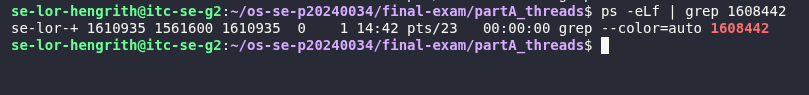
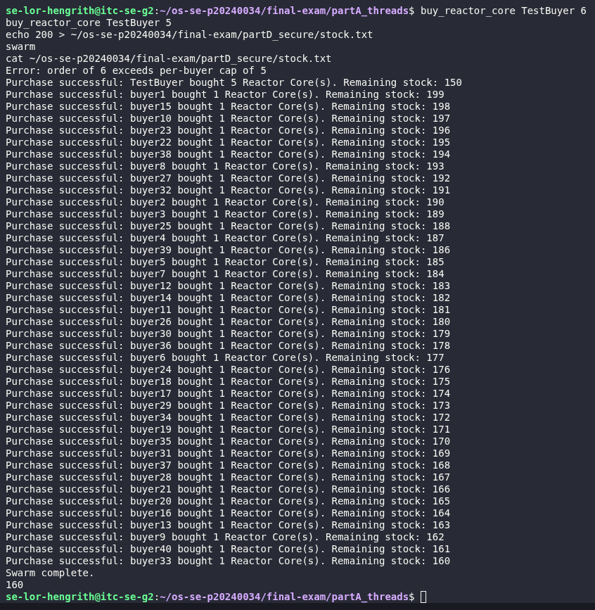
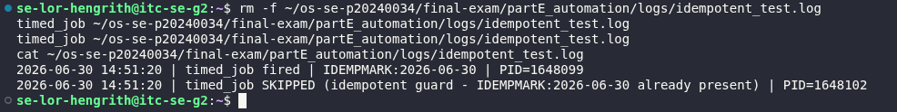

# live_mods.md — Live Modification (curveball) answers

> Released once, late in the exam. **Three curveballs: A, D, E.** For EACH, give: the
> announced instruction, the exact command(s) you ran, the **live value(s)** you acted
> on (your PID / stock / timestamp), and the screenshot.

---

## Curveball A — extra worker(s) that start after the others join

- **Issued value:** 1 extra worker(s)
- **Announced instruction:** Edit `thread_demo.c` to spawn this many extra workers that start only after the originals have joined; show the new LWP(s) appear in the mapping then disappear.
- **Live value(s) I acted on:** base PID = `1608442`; new LWP id that appeared = `1608771`
- **Commands:**

```bash
# edited thread_demo.c: added a 4th thread (extra_worker) spawned only after
# the original 3 threads were joined; rebuilt and ran
gcc -pthread thread_demo.c -o thread_demo
./thread_demo
ps -eLf | grep 1608442    # captured while extra worker was alive
sleep 16
ps -eLf | grep 1608442    # captured after program exited
```

- **Result:** While the extra worker thread was sleeping, `ps -eLf` showed PID `1608442` with two LWPs: `1608442` (main thread) and `1608771` (the new extra worker thread) — confirming a new kernel-scheduled entity appeared only after the original 3 threads had already joined. A follow-up `ps -eLf` after the program exited returned no matches for PID `1608442`, confirming the LWP and the process both disappeared cleanly once the extra worker finished.

- **Screenshot:**



---

## Curveball D — per-buyer purchase cap

- **Issued value:** cap = 5
- **Announced instruction:** Add a per-buyer purchase cap to your purchase script (`buy_reactor_core`) — reject any single order above it; re-run `swarm` and show the locked result respects the cap and stays consistent.
- **Live value(s) I acted on:** stock before cap test = 155; order rejected for exceeding the cap = qty 6 (`TestBuyer`); stock after accepted qty=5 order = 150; final stock after re-running swarm = 160
- **Commands:**

```bash
# added MAX_PER_BUYER=5 check to buy_reactor_core, right after the positive-integer
# validation and before the flock critical section
chmod +x ~/bin/buy_reactor_core
cp ~/bin/buy_reactor_core ~/os-se-p20240034/final-exam/partD_secure/scripts/buy_reactor_core

buy_reactor_core TestBuyer 6
buy_reactor_core TestBuyer 5
echo 200 > ~/os-se-p20240034/final-exam/partD_secure/stock.txt
swarm
cat ~/os-se-p20240034/final-exam/partD_secure/stock.txt
```

- **Result:** An order of qty=6 was correctly rejected ("Error: order of 6 exceeds per-buyer cap of 5"); an order of qty=5 (at the cap boundary) succeeded, decrementing stock from 155 to 150. After resetting stock to 200 and re-running `swarm` (40 buyers, 1 unit each, all under the cap), the final stock landed deterministically on 160 — the same correct result as before the cap was added — confirming the new cap check and the existing `flock` lock coexist correctly without introducing a new race or blocking legitimate purchases.

- **Screenshot:**



---

## Curveball E — idempotent timed_job

- **Issued value:** token = `IDEMPMARK`
- **Announced instruction:** Make `timed_job` idempotent using this marker token — it must refuse to run if the token for today is already in its log; trigger it twice and prove the 2nd was skipped.
- **Live value(s) I acted on:** today's marker line = `IDEMPMARK:2026-06-30`; 1st trigger PID=1648099 (ran), 2nd trigger PID=1648102 (skipped)
- **Commands:**

```bash
# added an idempotent guard to timed_job: each successful run writes a marker
# line "IDEMPMARK:<today's date>"; before writing, the script checks if that
# exact marker already exists in the output file, and if so logs a SKIPPED
# line and exits instead of duplicating the action
chmod +x ~/bin/timed_job
cp ~/bin/timed_job ~/os-se-p20240034/final-exam/partE_automation/scripts/timed_job

rm -f ~/os-se-p20240034/final-exam/partE_automation/logs/idempotent_test.log
timed_job ~/os-se-p20240034/final-exam/partE_automation/logs/idempotent_test.log
timed_job ~/os-se-p20240034/final-exam/partE_automation/logs/idempotent_test.log
cat ~/os-se-p20240034/final-exam/partE_automation/logs/idempotent_test.log
```

- **Result:** First call wrote a normal "fired" line containing today's marker `IDEMPMARK:2026-06-30` (PID 1648099). Second call detected the marker already present in the log and wrote a "SKIPPED" line instead (PID 1648102), proving the guard correctly prevented duplicate execution for the same day.

- **Screenshot:**

