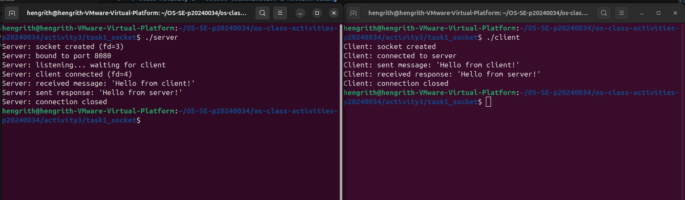
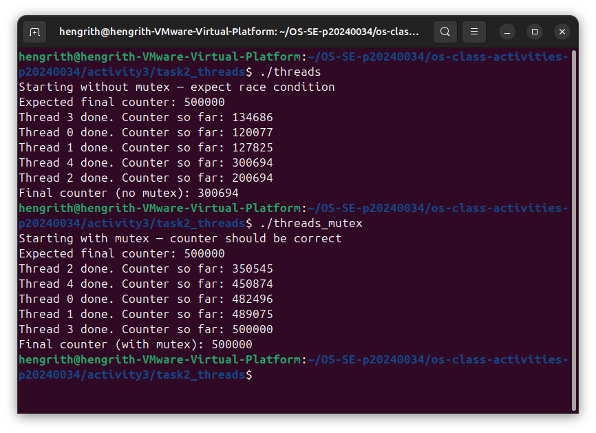
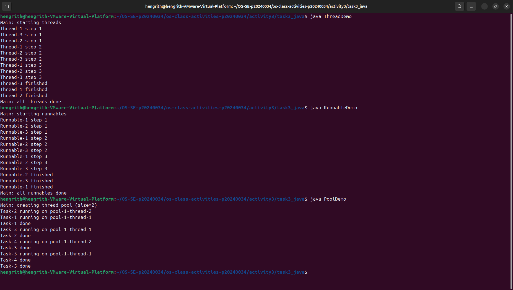
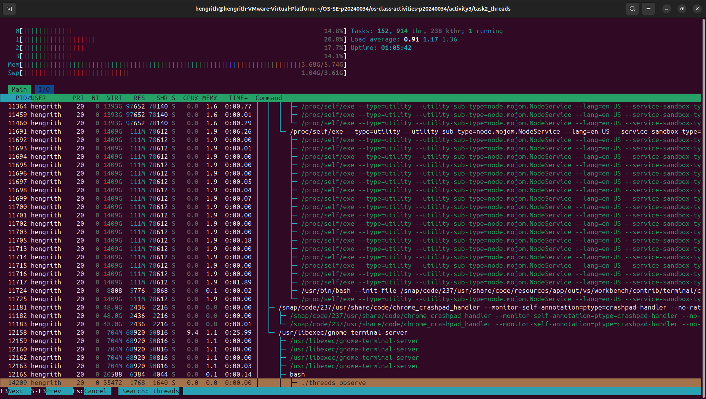
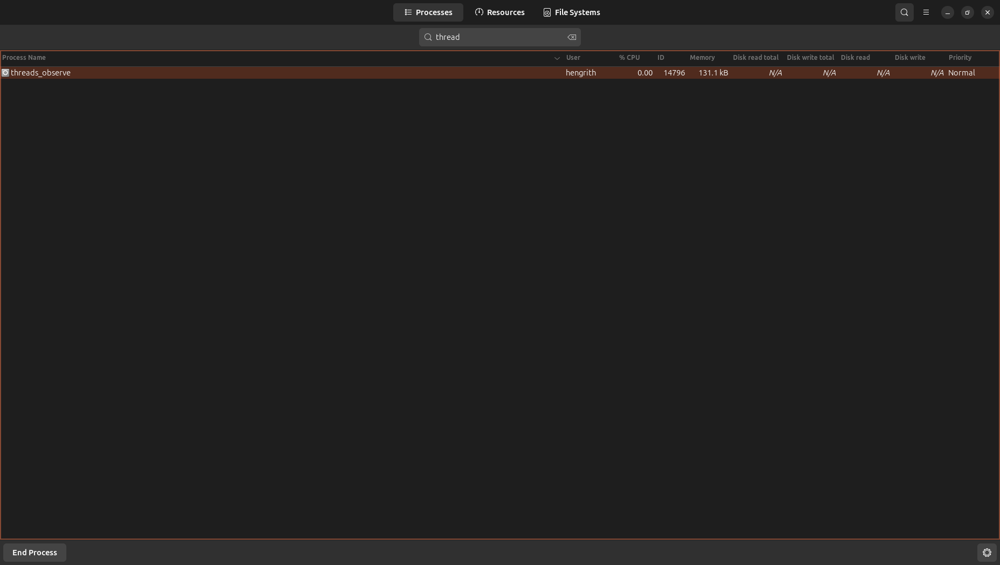

# Class Activity 3 — Socket Communication & Multithreading

> **Related Lectures**: Week 3 — Processes, Week 4 — Threads & Multicore  
> **Topics**: TCP Socket Communication (Client/Server), POSIX Threads (pthreads), Java Threading, Observing Threads in Linux & Windows  
> **Language**: C, Java  
> **Environment**: Linux (native, VM, or WSL) + Windows (for Java threading observation)

---

> ⚠️ **IMPORTANT — READ EVERYTHING FIRST**
>
> **Before you write a single line of code, read through this ENTIRE document from top to bottom.** Scan every section — the background, the tasks, the deliverables, and the README template. Understand the full scope of what is expected **before** you start working.
>
> ⏱️ **Estimated time**: Reading this document takes about **20–30 minutes**. Completing all tasks takes approximately **3–4 hours** depending on your experience.
>
> **Document structure:**
> 1. **Objective** — What you'll learn
> 2. **Prerequisites** — What you need set up
> 3. **Background** — Socket communication and threading concepts
> 4. **Task Overview** — Summary of all tasks at a glance
> 5. **Tasks 1–4 (Required)** — Detailed instructions for each task
> 6. **Deliverables & Submission** — Folder structure, README template, git push
> 7. **Grading Criteria** — How your work will be evaluated

---

## Quick Navigation

| Section | Jump To |
|---------|---------|
| Objective | [▶ Objective](#objective) |
| Prerequisites | [▶ Prerequisites](#prerequisites) |
| Background | [▶ Background](#background) |
| Task Overview | [▶ Task Overview](#task-overview) |
| Task 1: TCP Socket Server & Client (C) | [▶ Task 1](#task-1-tcp-socket-communication-c) |
| Task 2: POSIX Threads on Linux (C) | [▶ Task 2](#task-2-posix-threads-on-linux-c) |
| Task 3: Java Multithreading | [▶ Task 3](#task-3-java-multithreading) |
| Task 4: Observing Threads in Linux & Windows | [▶ Task 4](#task-4-observing-threads-in-linux--windows) |
| Deliverables & Submission | [▶ Deliverables](#deliverables--submission) |
| Grading Criteria | [▶ Grading](#grading-criteria) |
| References & Tips | [▶ References](#helpful-references) · [▶ Tips](#tips) |

---

## Objective

In the lectures, you learned that processes can **communicate** with each other over **sockets** (a network IPC mechanism) and that the OS schedules **threads** — lightweight units of execution within a process. In this activity, you will:

1. **Build a TCP client/server** in C using the POSIX socket API to exchange messages between two processes.
2. **Create and manage threads** on Linux using the POSIX Threads (pthreads) library.
3. **Write a multithreaded Java program** using `Thread` and `Runnable` and observe thread behavior.
4. **Observe threads** at the OS level using `ps`, `htop`, and Task Manager to see how the kernel schedules threads.

By the end, you will have hands-on experience with inter-process communication via sockets and concurrent programming with threads on two different operating systems.

---

## Prerequisites

- Basic C programming knowledge
- Basic Java programming knowledge
- Completed Class Activity 2 (familiarity with `fork()`, `exec()`, process concepts)
- A Linux environment (Ubuntu VM, WSL, or native Linux)
- GCC compiler installed (`gcc --version` to verify)
- Java JDK installed (`java --version` and `javac --version` to verify)
- A Windows environment (for Task 4 observation with Task Manager)

### Quick Setup

```bash
# Inside WSL or Linux, install build tools and Java
$ sudo apt update
$ sudo apt install build-essential default-jdk -y

# Verify
$ gcc --version
$ java --version
$ javac --version
```

---

## Background

### Socket Communication

A **socket** is an endpoint for communication between two processes — either on the same machine or across a network. Sockets use the **client-server** model:

```
 ┌──────────────┐                        ┌──────────────┐
 │    Server     │                        │    Client     │
 │               │                        │               │
 │  socket()     │                        │  socket()     │
 │  bind()       │                        │               │
 │  listen()     │                        │               │
 │  accept() ◄───┼──── TCP Handshake ────┼── connect()   │
 │               │                        │               │
 │  recv() ◄─────┼──── Data ─────────────┼── send()      │
 │  send() ──────┼──── Data ─────────────┼─► recv()      │
 │               │                        │               │
 │  close()      │                        │  close()      │
 └──────────────┘                        └──────────────┘
```

**Key POSIX socket functions:**

| Function | Purpose |
|----------|---------|
| `socket()` | Create a new socket (returns a file descriptor) |
| `bind()` | Bind socket to an address (IP + port) |
| `listen()` | Mark socket as passive (ready to accept connections) |
| `accept()` | Accept an incoming connection (blocks until a client connects) |
| `connect()` | Initiate a connection to a server |
| `send()` / `write()` | Send data through the socket |
| `recv()` / `read()` | Receive data from the socket |
| `close()` | Close the socket |

### Threads

A **thread** is the smallest unit of execution scheduled by the OS. Multiple threads within the same process share the same address space (code, data, heap) but each has its own **stack** and **registers**.

```
 ┌───────────────────────────────────────────────┐
 │                  Process                       │
 │  ┌─────────┐  ┌─────────┐  ┌─────────┐       │
 │  │ Thread 1 │  │ Thread 2 │  │ Thread 3 │       │
 │  │ (stack)  │  │ (stack)  │  │ (stack)  │       │
 │  └────┬─────┘  └────┬─────┘  └────┬─────┘       │
 │       │             │             │               │
 │       └─────────────┼─────────────┘               │
 │                     ▼                             │
 │          Shared: Code, Data, Heap                 │
 │          Shared: Open files, Signals              │
 └───────────────────────────────────────────────┘
```

**POSIX Threads (pthreads) — C:**

| Function | Purpose |
|----------|---------|
| `pthread_create()` | Create a new thread |
| `pthread_join()` | Wait for a thread to finish |
| `pthread_exit()` | Terminate the calling thread |
| `pthread_self()` | Get the calling thread's ID |
| `pthread_mutex_lock()` | Lock a mutex (mutual exclusion) |
| `pthread_mutex_unlock()` | Unlock a mutex |

**Java Threading:**

| Approach | Description |
|----------|-------------|
| `extends Thread` | Create a subclass of `Thread` and override `run()` |
| `implements Runnable` | Implement `Runnable` interface, pass to `Thread` constructor |
| `ExecutorService` | Thread pool management (modern approach) |
| `Thread.sleep()` | Pause the current thread |
| `thread.join()` | Wait for a thread to finish |
| `synchronized` | Mutual exclusion on a code block or method |

---

## Task Overview

| Task | What You Do | Where | Key Concepts |
|------|------------|-------|-------------|
| **Task 1** | Build a TCP server and client in C that exchange messages | Linux | `socket()`, `bind()`, `listen()`, `accept()`, `connect()`, `send()`, `recv()` |
| **Task 2** | Write a multithreaded C program using pthreads | Linux | `pthread_create()`, `pthread_join()`, thread IDs, shared data |
| **Task 3** | Write a multithreaded Java program using `Thread` and `Runnable` | Linux/Windows | `Thread`, `Runnable`, `ExecutorService`, `synchronized` |
| **Task 4** | Observe threads at the OS level using `ps`, `htop`, and Task Manager | Linux + Windows | `/proc/<pid>/task/`, `ps -eLf`, `htop` thread view, Task Manager |

---

## Task 1: TCP Socket Communication (C)

### Goal

Write a **TCP server** and a **TCP client** in C. The server listens on a port, accepts a connection, reads a message from the client, and sends a response back.

### Step-by-Step Instructions

#### 1. Navigate to your task folder

```bash
$ cd activity3/task1_socket
```

#### 2. Create the server

Create a file named `server.c`:

```c
/* server.c — Simple TCP server */
#include <stdio.h>
#include <stdlib.h>
#include <string.h>
#include <unistd.h>
#include <arpa/inet.h>

#define PORT 8080
#define BUFFER_SIZE 1024

int main() {
    int server_fd, client_fd;
    struct sockaddr_in address;
    int addrlen = sizeof(address);
    char buffer[BUFFER_SIZE] = {0};
    const char *response = "Hello from server!";

    /* 1. Create socket */
    server_fd = socket(AF_INET, SOCK_STREAM, 0);
    if (server_fd == -1) {
        perror("socket");
        exit(EXIT_FAILURE);
    }
    printf("Server: socket created (fd=%d)\n", server_fd);

    /* Allow port reuse (avoids "Address already in use" error) */
    int opt = 1;
    setsockopt(server_fd, SOL_SOCKET, SO_REUSEADDR, &opt, sizeof(opt));

    /* 2. Bind to address */
    address.sin_family = AF_INET;
    address.sin_addr.s_addr = INADDR_ANY;  /* Listen on all interfaces */
    address.sin_port = htons(PORT);

    if (bind(server_fd, (struct sockaddr *)&address, sizeof(address)) < 0) {
        perror("bind");
        close(server_fd);
        exit(EXIT_FAILURE);
    }
    printf("Server: bound to port %d\n", PORT);

    /* 3. Listen for connections */
    if (listen(server_fd, 1) < 0) {
        perror("listen");
        close(server_fd);
        exit(EXIT_FAILURE);
    }
    printf("Server: listening... waiting for a client to connect.\n");

    /* 4. Accept a connection */
    client_fd = accept(server_fd, (struct sockaddr *)&address, (socklen_t *)&addrlen);
    if (client_fd < 0) {
        perror("accept");
        close(server_fd);
        exit(EXIT_FAILURE);
    }
    printf("Server: client connected!\n");

    /* 5. Receive message from client */
    int bytes_read = read(client_fd, buffer, BUFFER_SIZE - 1);
    if (bytes_read > 0) {
        buffer[bytes_read] = '\0';
        printf("Server: received from client: \"%s\"\n", buffer);
    }

    /* 6. Send response to client */
    send(client_fd, response, strlen(response), 0);
    printf("Server: sent response: \"%s\"\n", response);

    /* 7. Close sockets */
    close(client_fd);
    close(server_fd);
    printf("Server: connection closed.\n");

    return 0;
}
```

#### 3. Create the client

Create a file named `client.c`:

```c
/* client.c — Simple TCP client */
#include <stdio.h>
#include <stdlib.h>
#include <string.h>
#include <unistd.h>
#include <arpa/inet.h>

#define PORT 8080
#define BUFFER_SIZE 1024

int main() {
    int sock_fd;
    struct sockaddr_in server_addr;
    char buffer[BUFFER_SIZE] = {0};
    const char *message = "Hello from client!";

    /* 1. Create socket */
    sock_fd = socket(AF_INET, SOCK_STREAM, 0);
    if (sock_fd == -1) {
        perror("socket");
        exit(EXIT_FAILURE);
    }
    printf("Client: socket created\n");

    /* 2. Set server address */
    server_addr.sin_family = AF_INET;
    server_addr.sin_port = htons(PORT);

    /* Convert "127.0.0.1" (localhost) to binary form */
    if (inet_pton(AF_INET, "127.0.0.1", &server_addr.sin_addr) <= 0) {
        perror("inet_pton");
        close(sock_fd);
        exit(EXIT_FAILURE);
    }

    /* 3. Connect to server */
    printf("Client: connecting to server on port %d...\n", PORT);
    if (connect(sock_fd, (struct sockaddr *)&server_addr, sizeof(server_addr)) < 0) {
        perror("connect");
        close(sock_fd);
        exit(EXIT_FAILURE);
    }
    printf("Client: connected!\n");

    /* 4. Send message to server */
    send(sock_fd, message, strlen(message), 0);
    printf("Client: sent message: \"%s\"\n", message);

    /* 5. Receive response from server */
    int bytes_read = read(sock_fd, buffer, BUFFER_SIZE - 1);
    if (bytes_read > 0) {
        buffer[bytes_read] = '\0';
        printf("Client: received from server: \"%s\"\n", buffer);
    }

    /* 6. Close socket */
    close(sock_fd);
    printf("Client: connection closed.\n");

    return 0;
}
```

#### 4. Compile both programs

```bash
$ gcc -o server server.c
$ gcc -o client client.c
```

#### 5. Run the server and client

You need **two terminals** (or two SSH sessions):

**Terminal 1 — Start the server:**

```bash
$ ./server
```

The server will print "listening..." and wait for a client.

**Terminal 2 — Run the client:**

```bash
$ ./client
```

You should see the message exchange:

**Server output:**
```
Server: socket created (fd=3)
Server: bound to port 8080
Server: listening... waiting for a client to connect.
Server: client connected!
Server: received from client: "Hello from client!"
Server: sent response: "Hello from server!"
Server: connection closed.
```

**Client output:**
```
Client: socket created
Client: connecting to server on port 8080...
Client: connected!
Client: sent message: "Hello from client!"
Client: received from server: "Hello from server!"
Client: connection closed.
```

#### 6. Save the output

```bash
$ ./server > result_server.txt 2>&1 &
$ sleep 1
$ ./client > result_client.txt 2>&1
$ wait
$ cat result_server.txt result_client.txt > result_socket.txt
```

#### 7. Save command history

```bash
$ history | tail -n 20 > command_used_socket.txt
```

> 📸 **Required Screenshot:** Take a screenshot showing both terminals — server and client — with the message exchange visible.

### Questions for Task 1

Answer these in your `README.md`:

1. **What is the role of `bind()` in the server? Why doesn't the client call `bind()`?**
2. **What does `accept()` return? How is it different from the original server socket?**
3. **What happens if you start the client before the server? Try it and describe the error.**
4. **What does `htons(PORT)` do? Why is byte order conversion needed?**
5. **Draw the sequence of socket calls for both server and client (socket → bind → listen → accept → read/write → close).**

---

## Task 2: POSIX Threads on Linux (C)

### Goal

Write a C program that creates multiple threads using the pthreads library. Each thread performs a task concurrently, and the main thread waits for all of them to finish.

### Step-by-Step Instructions

#### 1. Navigate to your task folder

```bash
$ cd ../task2_threads
```

#### 2. Create the source file

Create a file named `threads.c`:

```c
/* threads.c — POSIX Threads demonstration */
#include <stdio.h>
#include <stdlib.h>
#include <pthread.h>
#include <unistd.h>

#define NUM_THREADS 4

/* Shared counter (will demonstrate race condition) */
int shared_counter = 0;

/* Thread function — each thread increments the counter */
void *worker(void *arg) {
    int id = *(int *)arg;
    printf("Thread %d (TID: %lu): starting work...\n", id, (unsigned long)pthread_self());

    /* Simulate work */
    for (int i = 0; i < 100000; i++) {
        shared_counter++;  /* ⚠️ Race condition here! */
    }

    printf("Thread %d (TID: %lu): done.\n", id, (unsigned long)pthread_self());
    pthread_exit(NULL);
}

int main() {
    pthread_t threads[NUM_THREADS];
    int thread_ids[NUM_THREADS];

    printf("Main thread (TID: %lu): creating %d threads...\n",
           (unsigned long)pthread_self(), NUM_THREADS);
    printf("PID: %d — use this to observe threads with ps or htop\n\n", getpid());

    /* Create threads */
    for (int i = 0; i < NUM_THREADS; i++) {
        thread_ids[i] = i + 1;
        if (pthread_create(&threads[i], NULL, worker, &thread_ids[i]) != 0) {
            perror("pthread_create");
            exit(EXIT_FAILURE);
        }
    }

    /* Wait for all threads to finish */
    for (int i = 0; i < NUM_THREADS; i++) {
        pthread_join(threads[i], NULL);
    }

    printf("\nAll threads completed.\n");
    printf("Expected counter value: %d\n", NUM_THREADS * 100000);
    printf("Actual counter value:   %d\n", shared_counter);

    if (shared_counter != NUM_THREADS * 100000) {
        printf("⚠️  Race condition detected! Counter is incorrect.\n");
        printf("This happens because multiple threads modify shared_counter simultaneously.\n");
    }

    return 0;
}
```

#### 3. Compile with pthreads

```bash
$ gcc -o threads threads.c -pthread
```

> ⚠️ You **must** use `-pthread` flag when compiling pthreads programs.

#### 4. Run the program

```bash
$ ./threads > result_threads.txt 2>&1
$ cat result_threads.txt
```

Run it several times and notice that the final counter value may differ each time (race condition).

#### 5. Fix the race condition with a mutex

Create a file named `threads_mutex.c`:

```c
/* threads_mutex.c — Threads with mutex synchronization */
#include <stdio.h>
#include <stdlib.h>
#include <pthread.h>
#include <unistd.h>

#define NUM_THREADS 4

int shared_counter = 0;
pthread_mutex_t counter_mutex = PTHREAD_MUTEX_INITIALIZER;

void *worker(void *arg) {
    int id = *(int *)arg;
    printf("Thread %d (TID: %lu): starting work...\n", id, (unsigned long)pthread_self());

    for (int i = 0; i < 100000; i++) {
        pthread_mutex_lock(&counter_mutex);
        shared_counter++;  /* ✅ Protected by mutex */
        pthread_mutex_unlock(&counter_mutex);
    }

    printf("Thread %d (TID: %lu): done.\n", id, (unsigned long)pthread_self());
    pthread_exit(NULL);
}

int main() {
    pthread_t threads[NUM_THREADS];
    int thread_ids[NUM_THREADS];

    printf("Main thread (TID: %lu): creating %d threads (with mutex)...\n",
           (unsigned long)pthread_self(), NUM_THREADS);

    for (int i = 0; i < NUM_THREADS; i++) {
        thread_ids[i] = i + 1;
        pthread_create(&threads[i], NULL, worker, &thread_ids[i]);
    }

    for (int i = 0; i < NUM_THREADS; i++) {
        pthread_join(threads[i], NULL);
    }

    printf("\nAll threads completed.\n");
    printf("Expected counter value: %d\n", NUM_THREADS * 100000);
    printf("Actual counter value:   %d\n", shared_counter);

    if (shared_counter == NUM_THREADS * 100000) {
        printf("✅ Counter is correct! Mutex prevented the race condition.\n");
    }

    pthread_mutex_destroy(&counter_mutex);
    return 0;
}
```

#### 6. Compile and run the mutex version

```bash
$ gcc -o threads_mutex threads_mutex.c -pthread
$ ./threads_mutex > result_threads_mutex.txt 2>&1
$ cat result_threads_mutex.txt
```

The counter should now be correct every time.

#### 7. Save command history

```bash
$ history | tail -n 20 > command_used_threads.txt
```

> 📸 **Required Screenshot:** Take a screenshot showing the output of both `threads` (with race condition) and `threads_mutex` (correct result) side by side.

### Questions for Task 2

Answer these in your `README.md`:

1. **What is a race condition? Why does `shared_counter` produce an incorrect result in `threads.c`?**
2. **What does `pthread_mutex_lock()` do? Why does it fix the race condition?**
3. **What happens if you forget to call `pthread_join()`? Try removing it and describe the behavior.**
4. **How is a thread different from a process? What do threads share and what is private to each thread?**

---

## Task 3: Java Multithreading

### Goal

Write a multithreaded Java program using both `Thread` subclass and `Runnable` interface approaches, and explore Java's `ExecutorService` for thread pool management.

### Step-by-Step Instructions

#### 1. Navigate to your task folder

```bash
$ cd ../task3_java
```

#### 2. Create `ThreadDemo.java` — Thread subclass approach

```java
/* ThreadDemo.java — Creating threads by extending Thread */
public class ThreadDemo {

    /* Custom thread class */
    static class CounterThread extends Thread {
        private String name;
        private int count;

        CounterThread(String name, int count) {
            this.name = name;
            this.count = count;
        }

        @Override
        public void run() {
            for (int i = 1; i <= count; i++) {
                System.out.printf("[%s] Count: %d (Thread ID: %d)%n",
                    name, i, Thread.currentThread().getId());
                try {
                    Thread.sleep(500);  /* Simulate work */
                } catch (InterruptedException e) {
                    e.printStackTrace();
                }
            }
            System.out.printf("[%s] Finished!%n", name);
        }
    }

    public static void main(String[] args) throws InterruptedException {
        System.out.println("Main thread (ID: " + Thread.currentThread().getId() + "): starting...");
        System.out.println("PID: " + ProcessHandle.current().pid() + " — observe threads with ps or htop\n");

        /* Create and start 3 threads */
        CounterThread t1 = new CounterThread("Alpha", 5);
        CounterThread t2 = new CounterThread("Beta", 5);
        CounterThread t3 = new CounterThread("Gamma", 5);

        t1.start();
        t2.start();
        t3.start();

        /* Wait for all threads to finish */
        t1.join();
        t2.join();
        t3.join();

        System.out.println("\nMain thread: all threads finished.");
    }
}
```

#### 3. Compile and run

```bash
$ javac ThreadDemo.java
$ java ThreadDemo > result_thread_demo.txt 2>&1
$ cat result_thread_demo.txt
```

Notice how the three threads interleave their output — the OS schedules them concurrently.

#### 4. Create `RunnableDemo.java` — Runnable interface approach

```java
/* RunnableDemo.java — Creating threads with Runnable */
public class RunnableDemo {

    static class PrintTask implements Runnable {
        private String taskName;

        PrintTask(String name) {
            this.taskName = name;
        }

        @Override
        public void run() {
            for (int i = 1; i <= 3; i++) {
                System.out.printf("[%s] Step %d (Thread: %s, ID: %d)%n",
                    taskName, i, Thread.currentThread().getName(), Thread.currentThread().getId());
                try {
                    Thread.sleep(300);
                } catch (InterruptedException e) {
                    e.printStackTrace();
                }
            }
        }
    }

    public static void main(String[] args) throws InterruptedException {
        System.out.println("Main: creating threads with Runnable interface\n");

        Thread t1 = new Thread(new PrintTask("Download"), "downloader");
        Thread t2 = new Thread(new PrintTask("Process"), "processor");
        Thread t3 = new Thread(new PrintTask("Upload"), "uploader");

        t1.start();
        t2.start();
        t3.start();

        t1.join();
        t2.join();
        t3.join();

        System.out.println("\nMain: all tasks completed.");
    }
}
```

#### 5. Compile and run

```bash
$ javac RunnableDemo.java
$ java RunnableDemo > result_runnable_demo.txt 2>&1
$ cat result_runnable_demo.txt
```

#### 6. Create `PoolDemo.java` — ExecutorService thread pool

```java
/* PoolDemo.java — Thread pool with ExecutorService */
import java.util.concurrent.ExecutorService;
import java.util.concurrent.Executors;
import java.util.concurrent.TimeUnit;

public class PoolDemo {

    static class Task implements Runnable {
        private int taskId;

        Task(int id) {
            this.taskId = id;
        }

        @Override
        public void run() {
            System.out.printf("Task %d started on thread %s (ID: %d)%n",
                taskId, Thread.currentThread().getName(), Thread.currentThread().getId());
            try {
                Thread.sleep(1000);  /* Simulate work */
            } catch (InterruptedException e) {
                e.printStackTrace();
            }
            System.out.printf("Task %d completed on thread %s%n",
                taskId, Thread.currentThread().getName());
        }
    }

    public static void main(String[] args) throws InterruptedException {
        System.out.println("Main: creating thread pool with 2 threads for 6 tasks\n");

        /* Create a fixed pool of 2 threads */
        ExecutorService pool = Executors.newFixedThreadPool(2);

        /* Submit 6 tasks — only 2 run at a time */
        for (int i = 1; i <= 6; i++) {
            pool.submit(new Task(i));
        }

        /* Shut down the pool and wait for completion */
        pool.shutdown();
        pool.awaitTermination(30, TimeUnit.SECONDS);

        System.out.println("\nMain: all tasks completed. Pool shut down.");
    }
}
```

#### 7. Compile and run

```bash
$ javac PoolDemo.java
$ java PoolDemo > result_pool_demo.txt 2>&1
$ cat result_pool_demo.txt
```

Notice how only 2 tasks run at a time (the pool size), while the other 4 wait in a queue.

#### 8. Save command history

```bash
$ history | tail -n 30 > command_used_java.txt
```

> 📸 **Required Screenshot:** Take a screenshot showing the output of `ThreadDemo`, `RunnableDemo`, and `PoolDemo`.

### Questions for Task 3

Answer these in your `README.md`:

1. **What is the difference between extending `Thread` and implementing `Runnable`? When would you prefer one over the other?**
2. **In `PoolDemo`, why do only 2 tasks run simultaneously even though 6 are submitted?**
3. **What does `thread.join()` do in Java? What happens if you remove it from `ThreadDemo`?**
4. **Why is `ExecutorService` considered better than manually creating threads for large applications?**

---

## Task 4: Observing Threads in Linux & Windows

### Goal

Use OS-level tools to observe threads created by your programs. You will see how the operating system kernel views and schedules threads.

### Step-by-Step Instructions

#### Part A — Observing Threads on Linux

##### 1. Run the threaded C program with a sleep

Modify `threads.c` (or create `threads_observe.c`) to add a longer sleep so you have time to observe:

```c
/* threads_observe.c — Threads with sleep for observation */
#include <stdio.h>
#include <stdlib.h>
#include <pthread.h>
#include <unistd.h>

#define NUM_THREADS 4

void *worker(void *arg) {
    int id = *(int *)arg;
    printf("Thread %d (TID: %lu): sleeping 60 seconds...\n", id, (unsigned long)pthread_self());
    sleep(60);
    printf("Thread %d: done.\n", id);
    return NULL;
}

int main() {
    pthread_t threads[NUM_THREADS];
    int ids[NUM_THREADS];
    printf("PID: %d — observe threads now!\n\n", getpid());

    for (int i = 0; i < NUM_THREADS; i++) {
        ids[i] = i + 1;
        pthread_create(&threads[i], NULL, worker, &ids[i]);
    }
    for (int i = 0; i < NUM_THREADS; i++) {
        pthread_join(threads[i], NULL);
    }
    return 0;
}
```

```bash
$ gcc -o threads_observe threads_observe.c -pthread
$ ./threads_observe &
```

##### 2. Observe threads with `ps`

In another terminal:

```bash
# Show all threads for the process
$ ps -eLf | grep threads_observe

# Alternative: show threads with LWP (Light Weight Process) IDs
$ ps -T -p <PID>
```

You should see multiple rows — one for each thread — all sharing the same **PID** but with different **LWP** (thread) IDs.

```bash
# Save the output
$ ps -eLf | grep threads_observe > result_observe_linux.txt
$ ps -T -p <PID> >> result_observe_linux.txt
```

##### 3. Observe threads in `/proc`

```bash
# List thread directories (each is a thread's TID)
$ ls /proc/<PID>/task/

# Count threads
$ ls /proc/<PID>/task/ | wc -l
```

Append to the result file:

```bash
$ echo "--- /proc/<PID>/task/ listing ---" >> result_observe_linux.txt
$ ls /proc/<PID>/task/ >> result_observe_linux.txt
```

##### 4. Observe threads in `htop`

```bash
$ htop
```

- Press `F5` for tree view
- Press `Shift+H` to toggle **show individual threads**
- Find your `threads_observe` process and expand it

> 📸 **Required Screenshot:** Take a screenshot of `htop` showing individual threads of your program (after pressing Shift+H).

##### 5. Clean up

```bash
$ kill %1 2>/dev/null  # Kill the background threads_observe process
```

#### Part B — Observing Threads on Windows (Java)

##### 1. Run the Java ThreadDemo on Windows

Open a terminal (PowerShell or CMD) on Windows:

```powershell
javac ThreadDemo.java
java ThreadDemo
```

While the program is running (the threads sleep for 500ms each step, so you have ~2.5 seconds), observe in Task Manager.

> 💡 **Tip:** Increase the sleep time in `ThreadDemo.java` to `5000` (5 seconds per step) to have more time for observation.

##### 2. Observe threads in Task Manager

1. Open **Task Manager** (`Ctrl + Shift + Esc`)
2. Go to the **Details** tab
3. Find the `java.exe` process
4. Right-click the column headers → **Select columns** → check **"Threads"**
5. You should see the thread count for the Java process (it will be more than 3 because the JVM creates internal threads too)

> 📸 **Required Screenshot:** Task Manager Details tab showing `java.exe` with the Threads column visible.

##### 3. Use `jstack` for detailed thread dump (optional advanced)

While the Java program is running, in another terminal:

```powershell
jps                    # Find the PID of the Java process
jstack <PID>           # Print thread dump
```

This shows all threads (including JVM system threads), their states, and stack traces.

### Questions for Task 4

Answer these in your `README.md`:

1. **In the `ps -eLf` output, what is the LWP column? How does it relate to threads?**
2. **How many entries did you find in `/proc/<PID>/task/`? Does it match the number of threads in your program (including the main thread)?**
3. **In Task Manager, why does `java.exe` show more threads than the 3 you created? What are the extra threads?**
4. **Compare how Linux (`ps`, `/proc`) and Windows (Task Manager) display threads. Which gives more detail?**

---

## Deliverables & Submission

### What to Submit

Everything goes in your **README.md** — there is no separate answers file. Your `README.md` must contain:

1. **Your name and student ID**
2. **Screenshots** of compiling and running each task
3. **Answers** to all questions listed under each task
4. **Source code** files in the task folders
5. **Output files** (`.txt` files) as specified in each task

### Submission Folder Structure

All class activities go inside your personal `os-se-<YourStudentID>/` repository:

```
os-se-<YourStudentID>/
├── os-lab-<YourStudentID>/                  # ← Your lab submissions (existing)
│   └── ...
│
└── os-class-activities-<YourStudentID>/     # ← Your class activity submissions
    ├── activity1/                            # ← Activity 1 (already done)
    ├── activity2/                            # ← Activity 2 (already done)
    └── activity3/
        ├── README.md                         # ← Your report: screenshots + answers
        ├── screenshots/                      # Screenshot images
        │   ├── task1_socket_exchange.png
        │   ├── task2_threads_output.png
        │   ├── task3_java_output.png
        │   ├── task4_htop_threads.png
        │   └── task4_taskmanager_threads.png
        ├── task1_socket/
        │   ├── server.c
        │   ├── client.c
        │   ├── result_socket.txt
        │   └── command_used_socket.txt
        ├── task2_threads/
        │   ├── threads.c
        │   ├── threads_mutex.c
        │   ├── threads_observe.c
        │   ├── result_threads.txt
        │   ├── result_threads_mutex.txt
        │   ├── result_observe_linux.txt
        │   └── command_used_threads.txt
        └── task3_java/
            ├── ThreadDemo.java
            ├── RunnableDemo.java
            ├── PoolDemo.java
            ├── result_thread_demo.txt
            ├── result_runnable_demo.txt
            ├── result_pool_demo.txt
            └── command_used_java.txt
```

### Setting Up Your Activity Folder

```bash
# Navigate to your existing submission repo
$ cd os-se-<YourStudentID>

# Create the activity 3 folder structure
$ mkdir -p os-class-activities-<YourStudentID>/activity3/{task1_socket,task2_threads,task3_java,screenshots}

# Start working
$ cd os-class-activities-<YourStudentID>/activity3
```

### Pushing to Git

```bash
# Make sure you are in the root of your repo
$ cd os-se-<YourStudentID>

# Stage your class activity files
$ git add os-class-activities-<YourStudentID>/activity3/

# Commit with a meaningful message
$ git commit -m "Add class activity 3 — Socket Communication & Multithreading"

# Push to your remote repository
$ git push origin main
```

> **Reminder:** Commit and push **regularly** as you work — do not wait until the last minute.

### README Template for Activity 3

Create a `README.md` inside your `activity3/` folder using this template:

````markdown
# Class Activity 3 — Socket Communication & Multithreading

- **Student Name:** [Your Name Here]
- **Student ID:** [Your Student ID Here]
- **Date:** [Date of Submission]

---

## Task 1: TCP Socket Communication (C)

### Compilation & Execution



### Answers

1. **Role of `bind()` / Why client doesn't call it:**
   > _Your answer_

2. **What `accept()` returns:**
   > _Your answer_

3. **Starting client before server:**
   > _Your answer_

4. **What `htons()` does:**
   > _Your answer_

5. **Socket call sequence diagram:**
   > _Your diagram_

---

## Task 2: POSIX Threads (C)

### Output — Without Mutex (Race Condition)



### Output — With Mutex (Correct)

_(Include in the same screenshot or a separate one)_

### Answers

1. **What is a race condition?**
   > _Your answer_

2. **What does `pthread_mutex_lock()` do?**
   > _Your answer_

3. **Removing `pthread_join()`:**
   > _Your answer_

4. **Thread vs Process:**
   > _Your answer_

---

## Task 3: Java Multithreading

### ThreadDemo Output



### RunnableDemo Output

_(Include output or screenshot)_

### PoolDemo Output

_(Include output or screenshot)_

### Answers

1. **Thread vs Runnable:**
   > _Your answer_

2. **Pool size limiting concurrency:**
   > _Your answer_

3. **thread.join() in Java:**
   > _Your answer_

4. **ExecutorService advantages:**
   > _Your answer_

---

## Task 4: Observing Threads

### Linux — `ps -eLf` Output

_(Paste the relevant ps output here)_

### Linux — htop Thread View



### Windows — Task Manager



### Answers

1. **LWP column meaning:**
   > _Your answer_

2. **/proc/PID/task/ count:**
   > _Your answer_

3. **Extra Java threads:**
   > _Your answer_

4. **Linux vs Windows thread viewing:**
   > _Your answer_

---

## Reflection

> _What did you find most interesting about socket communication and threading? How does understanding threads at the OS level help you write better concurrent programs?_
````

---

## Grading Criteria

| Criteria | Points | Description |
|----------|--------|-------------|
| **Task 1 — Socket Communication** | 25 | Server/client compile, run, and exchange messages correctly. Output saved. Questions answered. |
| **Task 2 — POSIX Threads** | 25 | Both versions (race condition + mutex fix) compile and run. Race condition observed and explained. Questions answered. |
| **Task 3 — Java Multithreading** | 25 | All three Java programs compile and run. Thread interleaving and pool behavior observed. Questions answered. |
| **Task 4 — Thread Observation** | 15 | Screenshots of `ps`, `htop` (thread view), and Task Manager showing threads. Questions answered. |
| **README Quality** | 10 | Well-organized README with all screenshots embedded, clear answers, and reflection. |
| **Total** | **100** | |

---

## Helpful References

- [Beej's Guide to Network Programming](https://beej.us/guide/bgnet/) — Excellent socket programming reference
- [POSIX Threads Programming](https://hpc-tutorials.llnl.gov/posix/) — Detailed pthreads tutorial
- [Java Concurrency Tutorial](https://docs.oracle.com/javase/tutorial/essential/concurrency/) — Official Java threading guide
- `man 7 socket` — Linux socket manual page
- `man 7 pthreads` — Linux pthreads manual page

## Tips

- **Socket port conflicts:** If port 8080 is in use, change `PORT` to another number (e.g., 9090) in both server and client.
- **Thread output interleaving:** Thread output may appear in different orders each run — this is normal and expected.
- **Java classpath:** If you get "class not found" errors, make sure you're running `java` from the same directory where the `.class` files are.
- **htop thread view:** Press `Shift+H` to toggle showing individual threads. Press `F5` for tree view.
- **Compile flags:** Always use `-pthread` for C programs using pthreads. Use `-lrt` if `shm_open`/`mq_open` are not found.
