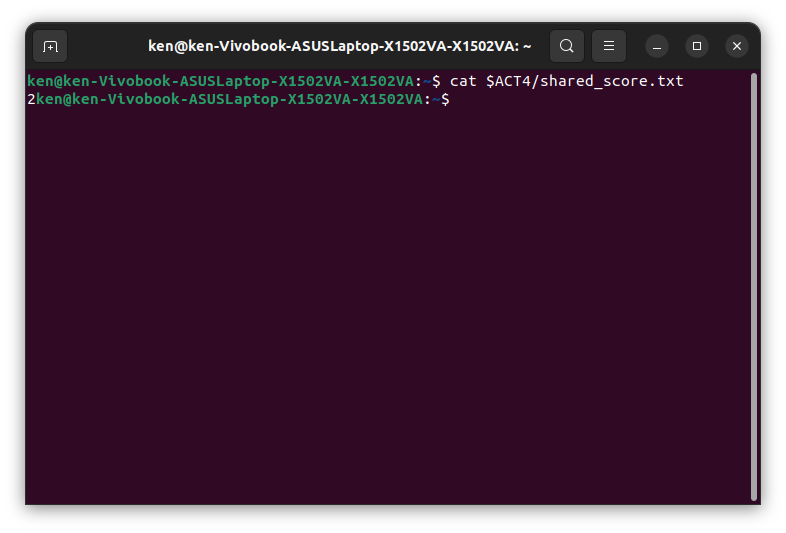
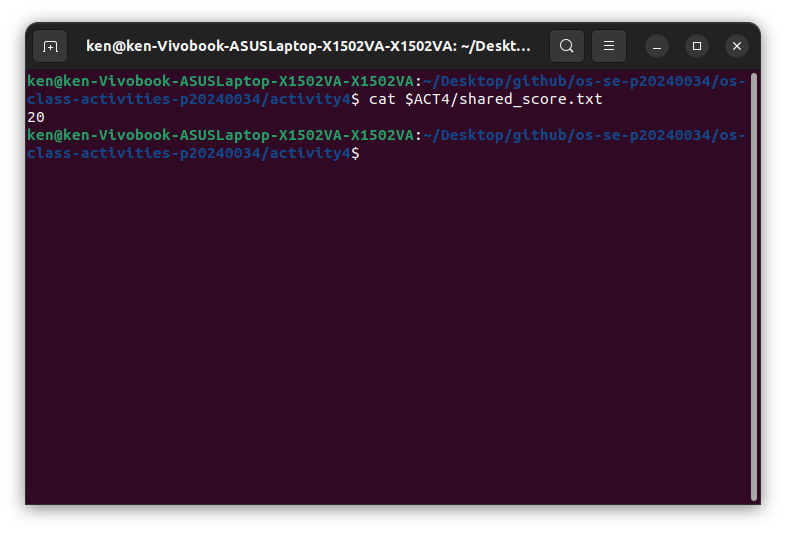
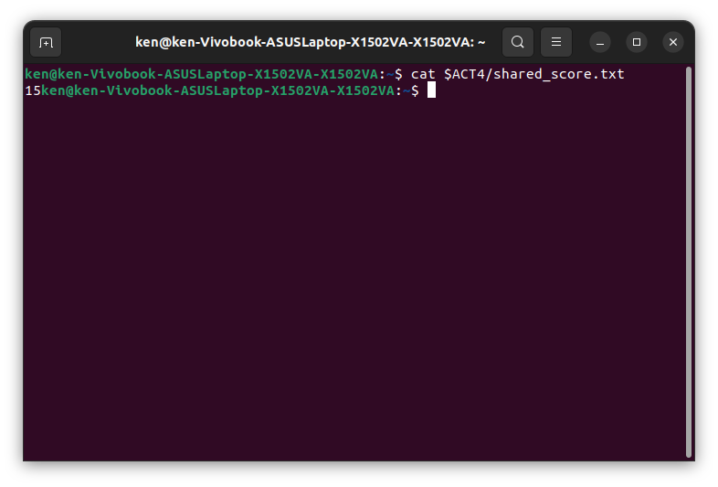
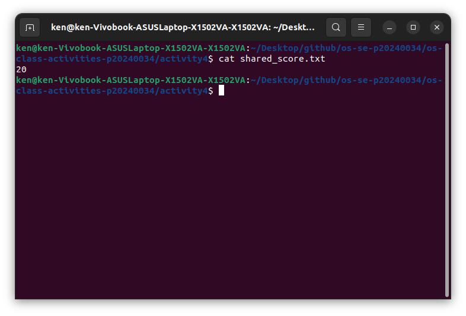

# Class Activity 4 — Shared File API

- **Student Name:** LOR Hengrith
- **Student ID:** p20240034
- **Partner Name:** Theng Vanheng
- **Partner Student ID:** p20240035
- **Server Machine Owner:** Theng Vanheng
- **Server IP Address:** 172.18.18.249

---

## Task 1: C++ Before Mutex

- Expected score after 20 total client requests: 20
- Actual score: [fill in what you got]
- What happened: Because there is no mutex, multiple threads read the file at the same time before any of them writes back. They all see the same old score, increment it to the same number, and write it back. So some updates cancel each other out and the final score ends up lower than 20.

---

## Task 2: C++ After Mutex

- Expected score after 20 total client requests: 20
- Actual score: 20
- What changed after adding mutex: The mutex forces threads to take turns. Only one thread can read and write the file at a time, so no two threads ever see the same old value. Every update goes through in order and the final score is always 20.

---

## Task 3: Java Before Synchronized

- Expected score after 20 total client requests: 20
- Actual score: [fill in what you got]
- What happened: Same problem as C++ without a mutex. Multiple threads run `updateScore` at the same time, read the same value, and overwrite each other. The score ends up lower than expected.

---

## Task 4: Java After Synchronized

- Expected score after 20 total client requests: 20
- Actual score: 20
- What changed after adding synchronized: The `synchronized` keyword makes Java lock the method so only one thread can run it at a time. All 20 updates happen one by one in order, so the final score is always exactly 20.

---

## Questions

1. **Why should clients send requests to the server instead of writing the file directly?**
   > If every client writes the file directly, you have many programs touching the same file at the same time and race conditions are almost certain. When you route everything through one server, only the server ever touches the file. It becomes a single controlled point of access, which is much easier to protect.

2. **Why does the server still have a race condition before mutex or synchronized?**
   > The server creates a new thread for each client. Those threads all run at the same time, so they can all reach the file update code at once. Even though there is only one server, its threads still race against each other just like separate programs would.

3. **In the C++ fixed version, what does `std::lock_guard<std::mutex>` protect?**
   > It protects the entire block of code that reads the file, increments the score, and writes it back. The lock is acquired at the start of that block and automatically released when the function returns. No other thread can enter that block while one thread is already inside it.

4. **In the Java fixed version, what does `synchronized` protect?**
   > It protects the `updateScore` method. Java puts a lock on it so only one thread can run that method at a time. Any other thread that tries to call it has to wait until the current one finishes.

5. **Why is the final score expected to be 20 when Student A sends 10 requests and Student B sends 10 requests?**
   > Each request should increment the score by 1. With 10 from Student A and 10 from Student B that is 20 increments total. As long as every update goes through without being lost or overwritten, the final result should be 20.

6. **What could happen if two separate servers update the same file at the same time?**
   > The same race condition would come back, just at a higher level. Each server has its own mutex or synchronized lock, but those only protect threads within that one server. Two separate server processes have no shared lock, so they can both read the same value, increment it, and write it back at the same time, losing updates just like the unsynchronized version.

---

## Reflection

> C++ and Java both solve the same problem but in slightly different ways. In C++ you have to explicitly create a mutex object and wrap the critical section with a lock guard. In Java you just add the `synchronized` keyword to the method and the language handles the locking for you. Java feels simpler to write, but C++ gives you more control. The main lesson from this activity is that a server is not automatically safe just because it is the only program writing the file. As soon as the server starts handling multiple clients with threads, it has the same race condition problem as any other multi-threaded program, and you have to protect shared resources intentionally.