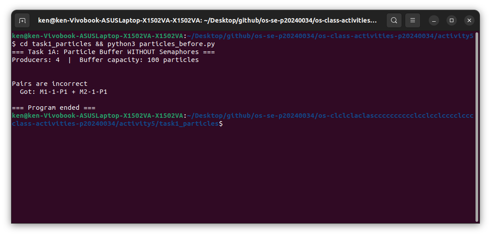
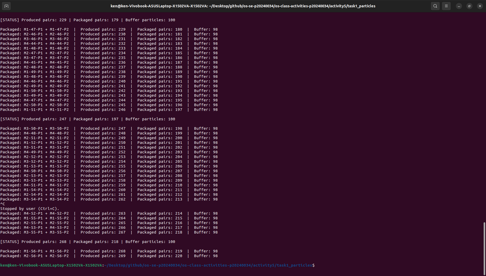
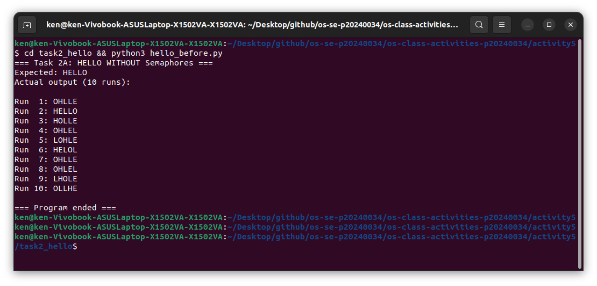
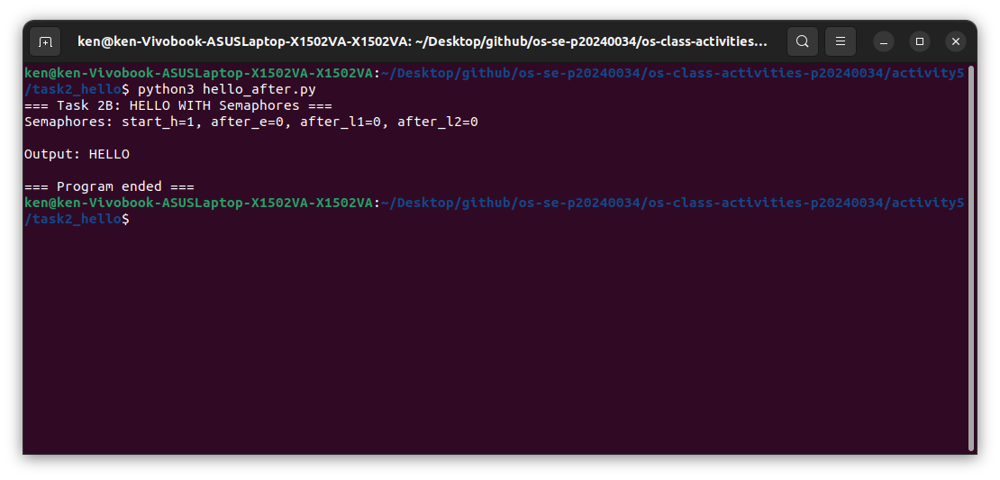

# Class Activity 5 - Semaphores

- **Student Name:** LOR Hengrith
- **Student ID:** p20240034
- **Programming Language Used:** Python

---

## Task 1A: Particle Pair Buffer Before Semaphores

- **Error appeared:** `Pairs are incorrect` — consumer fetched particles from different producers
- **Why:** No mutex means producers interleave, so mismatched particles end up adjacent in the buffer

---

## Task 1B: Particle Pair Buffer After Semaphores

- **Producers:** 4
- **Buffer capacity:** 100 particles (50 pairs)
- **Semaphores:** `empty_pairs=50`, `full_pairs=0`, `mutex=1`
- **Produced pairs:** *(fill in)*
- **Packaged pairs:** *(fill in)*
- **Errors during normal operation:** None

---

## Task 2A: HELLO Before Semaphores

- **Output:** Scrambled — e.g. `LOHLE`, `OHLLE`, never `HELLO`
- **Why:** All three threads start together with no ordering, so letters print in whatever order the scheduler runs them

---

## Task 2B: HELLO After Semaphores

- **Threads:** 3 (Process 1, 2, 3)
- **Semaphores:** `start_h=1`, `after_e=0`, `after_l1=0`, `after_l2=0`
- **Output:** `HELLO`

---

## Questions

1. A producer waits because the buffer has a fixed capacity. Adding without waiting can overflow it and corrupt existing data.

2. The consumer waits because removing from an empty buffer causes an underflow or crash.

3. `mutex` protects the critical section — only one thread can modify the buffer at a time.

4. Each particle is named `M<machine>-<pair_id>-P1/P2`. After popping two particles, the consumer compares their `M<machine>-<pair_id>` prefix. If they differ, it prints `Pairs are incorrect` and stops.

5. Without semaphores, all three threads run concurrently with no ordering. The OS scheduler and random timing decide who prints first, so the output is different every run.

6. `start_h` (init=1) lets Process 1 run immediately. All other semaphores start at 0, so Processes 2 and 3 are blocked until Process 1 finishes printing `H` and `E`.

7. Deadlock could happen if a thread holds `mutex` while waiting for `empty_pairs` or `full_pairs`. The fix is to always acquire the counting semaphore before `mutex`, never while holding it.

---

## Reflection

Task 1 showed how counting semaphores prevent overflow and underflow, and how a mutex makes multi-step buffer writes atomic. Task 2 showed that semaphores can also enforce execution order, not just protect resources. The same primitive solves both problems depending on its initial value.