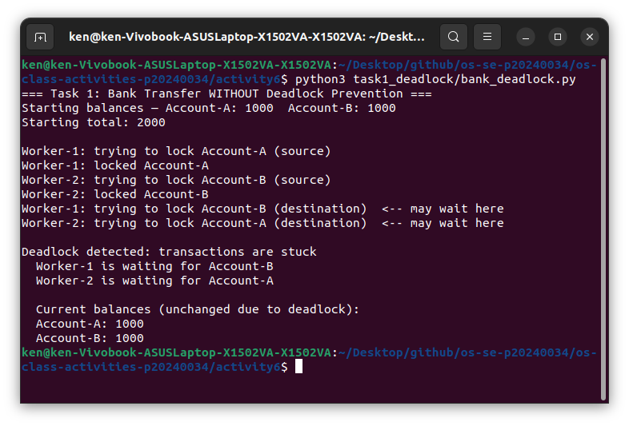
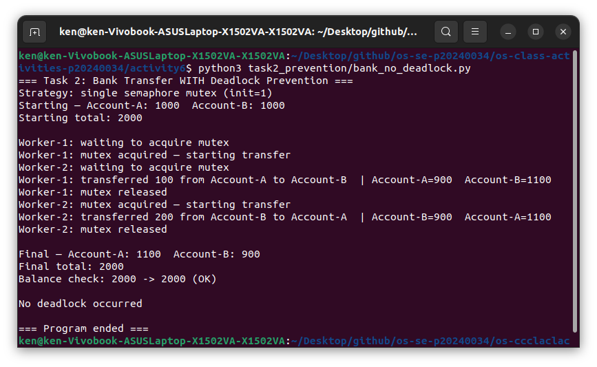

# Class Activity 6 - Deadlock Simulation

- **Student Name:** LOR Hengrith
- **Student ID:** p20240034
- **Programming Language Used:** Python

---
 
## Task 1: Deadlock Version

- **Shared resources:** Account-A and Account-B
- **Transaction 1:** Transfer 100 from Account-A to Account-B
- **Transaction 2:** Transfer 200 from Account-B to Account-A
- **Deadlock message:** `Deadlock detected: transactions are stuck`
- **Why it got stuck:** Worker-1 held Account-A and waited for Account-B. Worker-2 held Account-B and waited for Account-A. Neither could move forward.

---

## Task 2: Deadlock Prevention Version

- **Strategy:** Single semaphore mutex (init=1)
- **Starting total:** 2000
- **Final total:** 2000
- **Both transfers completed:** Yes
- **Why no deadlock:** Only one worker holds the mutex at a time so circular wait is impossible.

---

## Questions

1. The two shared resources are Account-A and Account-B.

2. Hold-and-wait is created when a worker locks the source account and then waits for the destination account while still holding the first lock.

3. Worker-1 holds Account-A and waits for Account-B while Worker-2 holds Account-B and waits for Account-A — a cycle where each holds what the other needs.

4. Without a watchdog the program hangs silently. The watchdog detects no progress after a timeout and prints the deadlock message so it is visible in the output.

5. Only one worker can hold the mutex at a time. The other waits until it is released so there is never a situation where two workers each hold one lock and wait for the other.

6. The single mutex removes circular wait and hold-and-wait. A worker acquires one lock for the whole operation and never waits for a second one.

7. Money only moves between accounts, never created or destroyed. A changed total means a transfer was applied incorrectly.

---

## Reflection

Deadlock happens naturally when threads lock shared resources in opposite orders. A single shared mutex fixes it by allowing only one transfer at a time, which keeps the system correct even if it reduces concurrency.