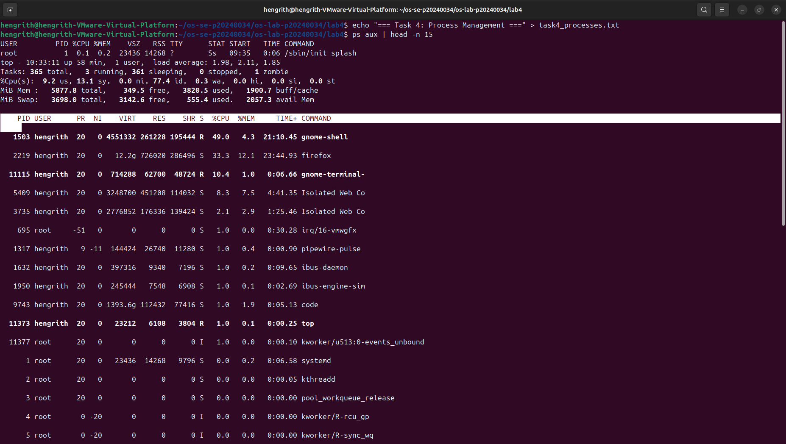
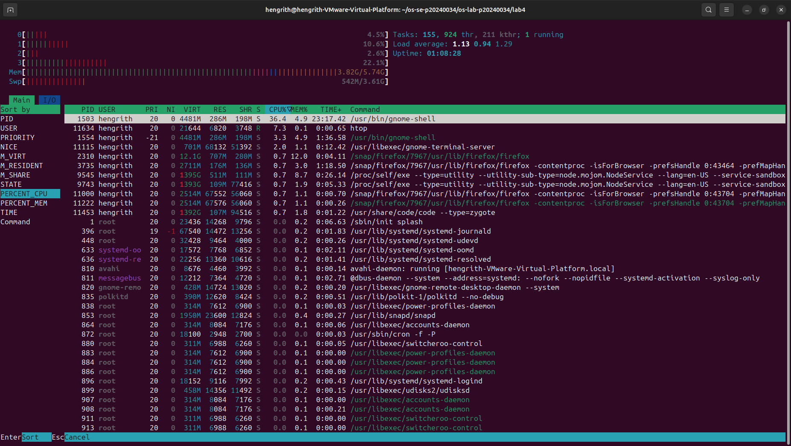
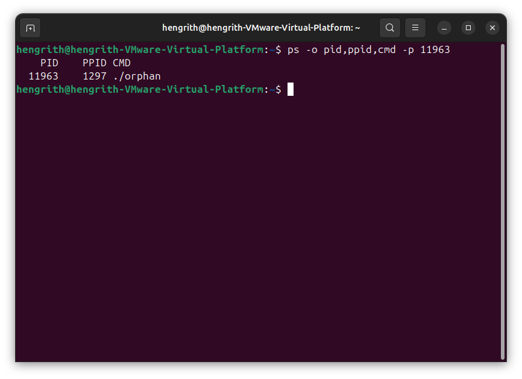
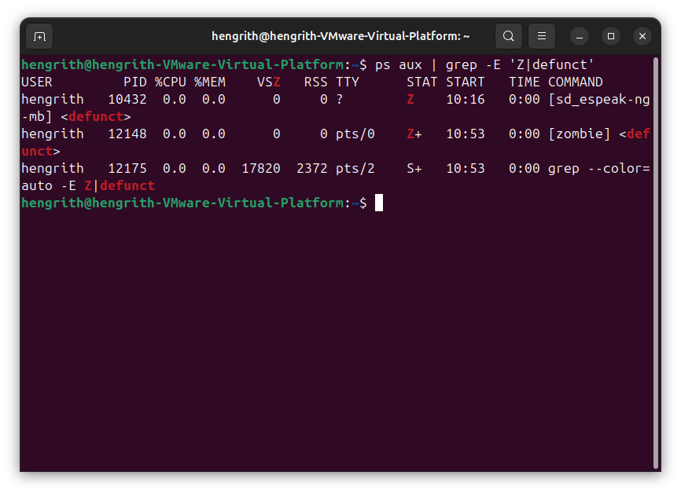

# OS Lab 4 — Linux I/O Redirection, Pipelines & Process Management (Hands-on)

| | |
|---|---|
| **Course** | Operating Systems |
| **Lab Title** | I/O Redirection, Pipelines, Data Analysis & Process Management |
| **Chapter** | Process Management & Linux Command-Line Tools |
| **Duration** | 3 Hours |
| **Lab Type** | Individual |

---

> ⚠️ **IMPORTANT — READ EVERYTHING FIRST**
>
> **Before you type a single command, read through this ENTIRE document from top to bottom.** Scan every section — the tasks, the challenges, the deliverables, the folder structure, and the README template. Understand the full scope of what is expected **before** you start working. Students who skip ahead often miss requirements and waste time redoing work.
>
> 🔑 **Key principle in this lab:** For every command, **run it first and observe the output on screen** before redirecting it to a file. Some commands (like `top`, `htop`) are **interactive** — they do NOT produce useful output when redirected to a file. You will learn which tools require screenshots instead of file redirection.
>
> **Document structure:**
> 1. **Lab Objectives** — What you'll learn
> 2. **Task Overview** — Summary of all tasks at a glance
> 3. **Lab Setup** — Repository and folder preparation
> 4. **Quick Reference Tables** — Command cheat sheets for each topic
> 5. **Tasks 1–5 (Required)** — Redirection, Pipelines, Data Analysis, Process Tools, Orphan & Zombie Processes
> 6. **Deliverables & Submission** — Folder structure, README template, git push
> 7. **Screenshot Checklist** — Every screenshot you need, in one place

---

## Quick Navigation

| Section | Jump To |
|---------|---------|
| Lab Objectives | [▶ Lab Objectives](#lab-objectives) |
| Task Overview | [▶ Task Overview](#task-overview) |
| Lab Setup | [▶ Lab Setup](#lab-setup) |
| Quick Reference: Redirection | [▶ Redirection](#quick-reference-io-redirection) |
| Quick Reference: Pipelines | [▶ Pipelines](#quick-reference-pipelines--filters) |
| Quick Reference: Process Tools | [▶ Process Tools](#quick-reference-process-management) |
| Task 1: I/O Redirection | [▶ Task 1](#task-1--io-redirection) |
| Task 2: Pipelines & Filters | [▶ Task 2](#task-2--pipelines--filters) |
| Task 3: Data Analysis | [▶ Task 3](#task-3--data-analysis-with-grep-cut--friends) |
| Task 4: Process Management | [▶ Task 4](#task-4--process-management-tools) |
| Task 5: Orphan & Zombie Processes | [▶ Task 5](#task-5--orphan--zombie-processes) |
| Submission | [▶ Submission](#final-submission-github-and-vs-code-documentation) |
| Screenshot Checklist | [▶ Screenshot Checklist](#screenshot-checklist) |

---

## Lab Objectives

After completing this lab, students will be able to:

1. Use standard I/O redirection operators (`>`, `>>`, `2>`, `2>&1`, `&>`) to control where command output goes.
2. Combine commands using pipes (`|`) to build processing pipelines.
3. Use `grep`, `cut`, `sort`, `uniq`, `wc`, `head`, `tail`, and `awk` to analyze and extract data from text files and command output.
4. Use `ps`, `top`, `htop`, `jobs`, `fg`, `bg`, and `kill` to monitor and control processes.
5. Understand and use Linux signals (`SIGTERM`, `SIGKILL`, `SIGSTOP`, `SIGCONT`) to manage running processes.
6. Create, observe, and explain orphan and zombie processes in a Linux environment.
7. Distinguish between interactive tools (that require screenshots) and commands that produce redirectable output.

> **Scenario:** You're **Alex**, now confident in basic Linux operations after three weeks at **TechCorp Inc.** Your manager says: *"Our server generates mountains of log files and process data. I need you to learn how to slice, filter, and redirect output efficiently — no more scrolling through terminal screens manually. Also, I want you to understand how to monitor and control processes, handle runaway jobs, and know what happens when parent processes die unexpectedly."*

---

## Task Overview

| Task | Title | Key Commands | Output Files | Screenshots |
|:---:|-------|-------------|:------------:|:-----------:|
| **1** | I/O Redirection | `>`, `>>`, `2>`, `2>&1`, `&>`, `<`, `/dev/null` | `task1_redirection.txt` | — |
| **2** | Pipelines & Filters | `\|`, `sort`, `uniq`, `wc`, `head`, `tail`, `tee` | `task2_pipelines.txt` | — |
| **3** | Data Analysis | `grep`, `cut`, `awk`, `sort`, `uniq -c` | `task3_analysis.txt` | — |
| **4** | Process Management | `ps`, `top`, `htop`, `jobs`, `fg`, `bg`, `kill`, `nohup` | `task4_processes.txt` | ✅ (top, htop) |
| **5** | Orphan & Zombie Processes | `fork()`, `exit()`, `sleep()`, `ps`, `kill` | `task5_orphan_zombie.txt` | ✅ |

---

## Lab Setup

Navigate into your existing lab submission repository and create the `lab4` directory:

```bash
$ cd ~/os-se-<YourStudentID>/os-lab-<YourStudentID>
$ mkdir lab4
$ cd lab4
```

### Documenting Your Work

1. **Output Files:** Most guided steps save results to `.txt` files via redirection. These are your primary proof of work.
2. **Interactive Tool Screenshots (Task 4):** Tools like `top` and `htop` are interactive — they continuously refresh the screen and do **NOT** produce meaningful output when redirected to a file. For these, you **must** take screenshots.
3. **Challenge Screenshots:** When you reach 🧩 **Challenge** sections, take a screenshot of your terminal.
4. **Orphan & Zombie Screenshots (Task 5):** Take screenshots showing the process states in `ps` output.
5. **Full History Screenshot:** After finishing all tasks, run `$ history | tail -n 100` and take a screenshot.
6. **Save All Images:** Save all screenshots to an `images/` folder in your lab4 directory.

### Lab Workflow Overview

```
┌──────────────────────────────────────────────────────────────────────────────┐
│                          WSL / Linux Terminal                                │
│                                                                              │
│  ┌──────────┐  ┌──────────┐  ┌──────────┐  ┌──────────┐  ┌──────────┐      │
│  │ Task 1   │  │ Task 2   │  │ Task 3   │  │ Task 4   │  │ Task 5   │      │
│  │Redirect- │─▶│Pipelines │─▶│  Data    │─▶│ Process  │─▶│ Orphan & │      │
│  │  ion     │  │& Filters │  │ Analysis │  │  Tools   │  │ Zombie   │      │
│  └──────────┘  └──────────┘  └──────────┘  └──────────┘  └──────────┘      │
│                                                                    │         │
│                                                                    ▼         │
│                                                              ┌───────────┐   │
│                                                              │ git push  │   │
│                                                              │ to GitHub │   │
│                                                              └─────┬─────┘   │
└────────────────────────────────────────────────────────────────────┼──────────┘
                                                                    │
┌───────────────────────────────────────────────────────────────────┘
│
▼
┌──────────────────────────────────────────────────────────────────────────────┐
│                         Host OS (Windows / Mac)                              │
│                                                                              │
│   ┌──────────────┐   ┌───────────────┐   ┌─────────────────────┐            │
│   │ Clone/Pull   │──▶│ Add Images &  │──▶│ Final git push      │            │
│   │ in VS Code   │   │ Write README  │   │ to GitHub           │            │
│   └──────────────┘   └───────────────┘   └─────────────────────┘            │
└──────────────────────────────────────────────────────────────────────────────┘
```

---

## Quick Reference: I/O Redirection

| Operator | Meaning | Example |
|----------|---------|---------|
| `>` | Redirect stdout (overwrite) | `ls > files.txt` |
| `>>` | Redirect stdout (append) | `echo "done" >> log.txt` |
| `2>` | Redirect stderr | `ls /fake 2> errors.txt` |
| `2>>` | Redirect stderr (append) | `ls /fake 2>> errors.txt` |
| `2>&1` | Redirect stderr to stdout | `cmd > all.txt 2>&1` |
| `&>` | Redirect both stdout & stderr | `cmd &> all.txt` |
| `<` | Redirect stdin from file | `sort < unsorted.txt` |
| `<<` | Here document | `cat << EOF` |
| `/dev/null` | Discard output (bit bucket) | `cmd > /dev/null 2>&1` |

## Quick Reference: Pipelines & Filters

| Command | Purpose | Example |
|---------|---------|---------|
| `\|` | Pipe stdout of left to stdin of right | `ls \| wc -l` |
| `sort` | Sort lines alphabetically/numerically | `sort -n numbers.txt` |
| `uniq` | Remove consecutive duplicate lines | `sort data \| uniq` |
| `uniq -c` | Count occurrences of each unique line | `sort data \| uniq -c` |
| `wc` | Count lines, words, bytes | `wc -l file.txt` |
| `head` | Show first N lines (default 10) | `head -n 5 file.txt` |
| `tail` | Show last N lines (default 10) | `tail -n 5 file.txt` |
| `tee` | Write to file AND pass through pipe | `ls \| tee files.txt \| wc -l` |
| `grep` | Filter lines matching a pattern | `grep "error" log.txt` |
| `cut` | Extract columns/fields | `cut -d: -f1 /etc/passwd` |
| `awk` | Pattern scanning & processing | `awk '{print $1}' file` |
| `tr` | Translate or delete characters | `echo "HELLO" \| tr A-Z a-z` |

## Quick Reference: Process Management

| Command | Purpose | Example |
|---------|---------|---------|
| `ps` | Snapshot of current processes | `ps aux` |
| `ps --forest` | Process tree view | `ps -ef --forest` |
| `top` | **Interactive** real-time process viewer | `top` (press `q` to quit) |
| `htop` | **Interactive** enhanced process viewer | `htop` (press `q` to quit) |
| `jobs` | List background/stopped jobs (current shell) | `jobs -l` |
| `fg` | Bring background job to foreground | `fg %1` |
| `bg` | Resume stopped job in background | `bg %1` |
| `Ctrl+Z` | Suspend (stop) foreground process | — |
| `Ctrl+C` | Terminate foreground process (SIGINT) | — |
| `&` | Run command in background | `sleep 100 &` |
| `kill` | Send signal to process | `kill -9 <PID>` |
| `kill -l` | List all signal names | `kill -l` |
| `nohup` | Run command immune to hangup | `nohup cmd &` |
| `pgrep` | Find PID by name | `pgrep sleep` |
| `pkill` | Kill processes by name | `pkill sleep` |

### Common Signals

| Signal | Number | Name | Default Action |
|--------|--------|------|---------------|
| `SIGTERM` | 15 | Terminate | Graceful termination (can be caught) |
| `SIGKILL` | 9 | Kill | Immediate termination (cannot be caught) |
| `SIGSTOP` | 19 | Stop | Suspend process (cannot be caught) |
| `SIGCONT` | 18 | Continue | Resume a stopped process |
| `SIGINT` | 2 | Interrupt | Ctrl+C — interrupt from keyboard |
| `SIGHUP` | 1 | Hangup | Terminal closed / parent died |

---

## Task 1 — I/O Redirection

**Scenario:** Your manager says: *"Our servers generate output and errors constantly. You need to know how to capture, separate, and redirect that output — otherwise you'll be staring at a scrolling terminal all day."*

**Purpose:** Learn to redirect standard output (stdout), standard error (stderr), and standard input (stdin) using shell operators.

> 🔑 **Remember:** Always **run a command first without redirection** to see what it does on screen. Then redirect it to a file.

**Instructions:**

1. Create sample data and the output file:

   ```bash
   $ mkdir -p redirect_lab
   $ cd redirect_lab
   $ echo "=== Task 1: I/O Redirection ===" > ../task1_redirection.txt
   ```

2. **Stdout redirection (`>` and `>>`)** — capture normal output:

   First, **observe** the output on screen:

   ```bash
   $ ls /etc | head -n 10
   ```

   Now redirect to a file (overwrites):

   ```bash
   $ echo "--- stdout to file (overwrite) ---" >> ../task1_redirection.txt
   $ ls /etc | head -n 10 > etc_listing.txt
   $ cat etc_listing.txt >> ../task1_redirection.txt
   ```

   Append more output to the same file:

   ```bash
   $ echo "--- stdout append ---" >> ../task1_redirection.txt
   $ echo "First line" > append_demo.txt
   $ echo "Second line" >> append_demo.txt
   $ echo "Third line" >> append_demo.txt
   $ cat append_demo.txt >> ../task1_redirection.txt
   ```

3. **Stderr redirection (`2>`)** — capture error messages separately:

   First, observe the error on screen:

   ```bash
   $ ls /nonexistent_directory
   ```

   You should see an error message. Now redirect only errors:

   ```bash
   $ echo "--- stderr redirection ---" >> ../task1_redirection.txt
   $ ls /nonexistent_directory 2> errors.txt
   $ cat errors.txt >> ../task1_redirection.txt
   ```

4. **Separate stdout and stderr:**

   ```bash
   $ echo "--- separate stdout and stderr ---" >> ../task1_redirection.txt
   $ ls /etc /nonexistent_directory > stdout.txt 2> stderr.txt
   $ echo "stdout:" >> ../task1_redirection.txt
   $ cat stdout.txt >> ../task1_redirection.txt
   $ echo "stderr:" >> ../task1_redirection.txt
   $ cat stderr.txt >> ../task1_redirection.txt
   ```

5. **Combine stdout and stderr (`2>&1` and `&>`):**

   ```bash
   $ echo "--- combined stdout+stderr (2>&1) ---" >> ../task1_redirection.txt
   $ ls /etc /nonexistent_directory > combined1.txt 2>&1
   $ cat combined1.txt >> ../task1_redirection.txt

   $ echo "--- combined stdout+stderr (&>) ---" >> ../task1_redirection.txt
   $ ls /etc /nonexistent_directory &> combined2.txt
   $ cat combined2.txt >> ../task1_redirection.txt
   ```

6. **Discard output with `/dev/null`:**

   ```bash
   $ echo "--- /dev/null (discard output) ---" >> ../task1_redirection.txt

   # Discard stdout, keep stderr
   $ ls /etc /nonexistent_directory > /dev/null
   $ echo "The above only showed errors on screen (stdout discarded)" >> ../task1_redirection.txt

   # Discard everything
   $ ls /etc /nonexistent_directory > /dev/null 2>&1
   $ echo "The above showed nothing (all output discarded)" >> ../task1_redirection.txt
   ```

7. **Stdin redirection (`<`):**

   ```bash
   $ echo "--- stdin redirection ---" >> ../task1_redirection.txt
   $ echo -e "banana\napple\ncherry\ndate\napple" > fruits.txt

   # Sort reads from stdin (the file)
   $ sort < fruits.txt >> ../task1_redirection.txt
   ```

8. Return to lab4:

   ```bash
   $ cd ..
   ```

### 🧩 Challenge — Redirection on Your Own

```bash
$ echo "--- Challenge Redirection ---" >> task1_redirection.txt
```

1a. Run `find /etc -name "*.conf"` and redirect **only errors** to `/dev/null` while keeping the actual results visible on screen. Then redirect the results to `task1_redirection.txt`.

1b. Create a **here document** that writes exactly three lines (your name, student ID, and today's date) to a file called `student_info.txt`. Append its contents to `task1_redirection.txt`.

1c. Use the `tee` command to simultaneously display `ls -la /etc | head -n 15` on screen **and** save it to a file called `tee_output.txt`. Append the file to `task1_redirection.txt`.

**Output File:** `task1_redirection.txt`

---

## Task 2 — Pipelines & Filters

**Scenario:** *"Now that you can redirect output, let's chain commands together. Pipes are how real sysadmins work — one command's output flows directly into the next."*

**Purpose:** Learn to combine multiple commands using the pipe operator (`|`) to build powerful data processing pipelines.

> 🔑 **Run each pipeline on screen first** to see the result, then redirect or append to your output file.

**Instructions:**

1. Setup:

   ```bash
   $ echo "=== Task 2: Pipelines & Filters ===" > task2_pipelines.txt
   ```

2. **Basic pipe — counting files:**

   First observe:

   ```bash
   $ ls /etc | wc -l
   ```

   ```bash
   $ echo "--- Number of entries in /etc ---" >> task2_pipelines.txt
   $ ls /etc | wc -l >> task2_pipelines.txt
   ```

3. **Sorting and deduplication:**

   ```bash
   $ echo -e "zebra\napple\nbanana\napple\ncherry\nbanana\napple" > names.txt

   $ echo "--- Sorted unique names ---" >> task2_pipelines.txt
   $ sort names.txt | uniq >> task2_pipelines.txt

   $ echo "--- Count of each name ---" >> task2_pipelines.txt
   $ sort names.txt | uniq -c | sort -rn >> task2_pipelines.txt
   ```

4. **Head and tail — selecting ranges:**

   ```bash
   $ echo "--- First 5 users in /etc/passwd ---" >> task2_pipelines.txt
   $ cat /etc/passwd | head -n 5 >> task2_pipelines.txt

   $ echo "--- Last 3 users in /etc/passwd ---" >> task2_pipelines.txt
   $ cat /etc/passwd | tail -n 3 >> task2_pipelines.txt
   ```

5. **Multi-stage pipeline — find the top 5 largest directories:**

   First observe:

   ```bash
   $ du -sh /usr/* 2>/dev/null | sort -rh | head -n 5
   ```

   ```bash
   $ echo "--- Top 5 largest directories under /usr ---" >> task2_pipelines.txt
   $ du -sh /usr/* 2>/dev/null | sort -rh | head -n 5 >> task2_pipelines.txt
   ```

6. **Using `tee` — split pipeline output:**

   ```bash
   $ echo "--- Pipeline with tee ---" >> task2_pipelines.txt
   $ ls -la /etc | head -n 20 | tee etc_snapshot.txt | wc -l >> task2_pipelines.txt
   $ echo "(also saved to etc_snapshot.txt)" >> task2_pipelines.txt
   ```

7. **Translate and transform with `tr`:**

   ```bash
   $ echo "--- Uppercase to lowercase ---" >> task2_pipelines.txt
   $ echo "HELLO WORLD FROM TECHCORP" | tr 'A-Z' 'a-z' >> task2_pipelines.txt

   $ echo "--- Remove duplicate spaces ---" >> task2_pipelines.txt
   $ echo "too    many     spaces    here" | tr -s ' ' >> task2_pipelines.txt
   ```

### 🧩 Challenge — Pipelines on Your Own

```bash
$ echo "--- Challenge Pipelines ---" >> task2_pipelines.txt
```

2a. Count how many **directories** (not files) are in `/etc` using `ls -la` and `grep` in a pipeline. (Hint: directories start with `d` in the `ls -la` output.)

2b. List all users in `/etc/passwd`, extract only the usernames (first field, delimiter `:`), sort them alphabetically, and show the **last 5**. All in one pipeline.

2c. Find all `.conf` files under `/etc` using `find`, count them, and display the count. Suppress errors with redirection.

**Output File:** `task2_pipelines.txt`

---

## Task 3 — Data Analysis with `grep`, `cut` & Friends

**Scenario:** *"We have log files and system data that need to be analyzed daily. I need you to extract specific information using grep, cut, and awk — these are the Swiss Army knives of Linux text processing."*

**Purpose:** Use text processing tools to analyze real system files, extract fields, filter patterns, and produce summaries.

**Instructions:**

1. Setup — create a sample access log for analysis:

   ```bash
   $ echo "=== Task 3: Data Analysis ===" > task3_analysis.txt

   $ cat << 'EOF' > access.log
   192.168.1.10 - - [01/Jan/2025:10:15:32] "GET /index.html" 200 1024
   192.168.1.20 - - [01/Jan/2025:10:16:01] "POST /login" 401 512
   192.168.1.10 - - [01/Jan/2025:10:17:45] "GET /dashboard" 200 2048
   10.0.0.5 - - [01/Jan/2025:10:18:22] "GET /api/data" 200 4096
   192.168.1.20 - - [01/Jan/2025:10:19:10] "POST /login" 200 768
   10.0.0.5 - - [01/Jan/2025:10:20:03] "GET /api/users" 403 256
   192.168.1.30 - - [01/Jan/2025:10:21:55] "GET /index.html" 200 1024
   192.168.1.10 - - [01/Jan/2025:10:22:40] "DELETE /api/data" 405 128
   10.0.0.5 - - [01/Jan/2025:10:23:18] "GET /api/data" 200 4096
   192.168.1.20 - - [01/Jan/2025:10:24:02] "GET /dashboard" 200 2048
   EOF
   ```

2. **`grep` — pattern searching:**

   ```bash
   $ echo "--- All GET requests ---" >> task3_analysis.txt
   $ grep "GET" access.log >> task3_analysis.txt

   $ echo "--- All requests from 192.168.1.10 ---" >> task3_analysis.txt
   $ grep "192.168.1.10" access.log >> task3_analysis.txt

   $ echo "--- All non-200 status codes (failed requests) ---" >> task3_analysis.txt
   $ grep -v '" 200 ' access.log >> task3_analysis.txt

   $ echo "--- Count of POST requests ---" >> task3_analysis.txt
   $ grep -c "POST" access.log >> task3_analysis.txt

   $ echo "--- Lines with error codes (4xx) ---" >> task3_analysis.txt
   $ grep -E '" (40[0-9]|4[1-9][0-9]) ' access.log >> task3_analysis.txt
   ```

3. **`cut` — extracting fields:**

   ```bash
   $ echo "--- Usernames from /etc/passwd (field 1) ---" >> task3_analysis.txt
   $ cut -d: -f1 /etc/passwd | head -n 10 >> task3_analysis.txt

   $ echo "--- IP addresses from access log ---" >> task3_analysis.txt
   $ cut -d' ' -f1 access.log >> task3_analysis.txt

   $ echo "--- User shells from /etc/passwd (fields 1 and 7) ---" >> task3_analysis.txt
   $ cut -d: -f1,7 /etc/passwd | head -n 10 >> task3_analysis.txt
   ```

4. **`awk` — advanced field processing:**

   ```bash
   $ echo "--- IP and status code with awk ---" >> task3_analysis.txt
   $ awk '{print $1, $9}' access.log >> task3_analysis.txt

   $ echo "--- Total bytes transferred ---" >> task3_analysis.txt
   $ awk '{sum += $10} END {print "Total bytes:", sum}' access.log >> task3_analysis.txt

   $ echo "--- Requests per IP ---" >> task3_analysis.txt
   $ awk '{print $1}' access.log | sort | uniq -c | sort -rn >> task3_analysis.txt
   ```

5. **Combined analysis pipeline:**

   ```bash
   $ echo "--- Top requested URLs ---" >> task3_analysis.txt
   $ awk '{print $7}' access.log | sort | uniq -c | sort -rn >> task3_analysis.txt

   $ echo "--- Unique IP addresses ---" >> task3_analysis.txt
   $ cut -d' ' -f1 access.log | sort -u >> task3_analysis.txt

   $ echo "--- Status code summary ---" >> task3_analysis.txt
   $ awk '{print $9}' access.log | sort | uniq -c | sort -rn >> task3_analysis.txt
   ```

6. **Analyze a real system file — `/etc/passwd`:**

   ```bash
   $ echo "--- Users with /bin/bash shell ---" >> task3_analysis.txt
   $ grep "/bin/bash" /etc/passwd | cut -d: -f1 >> task3_analysis.txt

   $ echo "--- Number of system users (UID < 1000) ---" >> task3_analysis.txt
   $ awk -F: '$3 < 1000 {count++} END {print "System users:", count}' /etc/passwd >> task3_analysis.txt

   $ echo "--- Number of regular users (UID >= 1000) ---" >> task3_analysis.txt
   $ awk -F: '$3 >= 1000 {count++} END {print "Regular users:", count}' /etc/passwd >> task3_analysis.txt
   ```

### 🧩 Challenge — Data Analysis on Your Own

```bash
$ echo "--- Challenge Data Analysis ---" >> task3_analysis.txt
```

3a. From `access.log`, find all requests that resulted in **403 (Forbidden)** status and extract just the **IP address** and the **URL** that was requested. Use a combination of `grep`, `awk` or `cut`.

3b. From `/etc/passwd`, create a summary that shows how many users use each different shell. (Hint: `cut` the shell field, then `sort | uniq -c`.)

3c. Find the IP address that made the **most requests** in `access.log` and show the count. Do this in a single pipeline.

**Output File:** `task3_analysis.txt`

---

## Task 4 — Process Management Tools

**Scenario:** *"A rogue process is eating CPU. Another job needs to be paused and resumed later. You need to know how to monitor, control, and signal processes — this is core sysadmin work."*

**Purpose:** Learn to monitor running processes, manage foreground/background jobs, and send signals.

> ⚠️ **IMPORTANT — Interactive vs. Redirectable Commands**
>
> Some commands in this task are **interactive** — they continuously update the screen in real-time:
> - `top` — refreshes every few seconds; **cannot** produce useful file output
> - `htop` — same as top but enhanced; **cannot** produce useful file output
>
> For these tools, **take screenshots** instead of redirecting to a file.
>
> Commands like `ps`, `jobs`, `kill` produce **static output** and can be redirected normally.

**Instructions:**

1. Setup:

   ```bash
   $ echo "=== Task 4: Process Management ===" > task4_processes.txt
   ```

2. **`ps` — process snapshots:**

   First, observe on screen:

   ```bash
   $ ps aux | head -n 15
   ```

   Then record:

   ```bash
   $ echo "--- Current processes (your user) ---" >> task4_processes.txt
   $ ps -u $USER >> task4_processes.txt

   $ echo "--- All processes (snapshot) ---" >> task4_processes.txt
   $ ps aux | head -n 20 >> task4_processes.txt

   $ echo "--- Process tree ---" >> task4_processes.txt
   $ ps -ef --forest | head -n 30 >> task4_processes.txt
   ```

3. **`top` — interactive real-time monitoring (SCREENSHOT REQUIRED):**

   > ⚠️ `top` is an **interactive** tool. It will NOT produce useful output in a file. Do NOT try `top > file.txt` — the result will be garbled or empty.

   ```bash
   $ top
   ```

   **While `top` is running:**
   - Observe the **header** showing uptime, CPU usage, and memory
   - Note the **PID**, **USER**, **%CPU**, **%MEM**, **COMMAND** columns
   - Press `Shift+M` to sort by memory usage
   - Press `Shift+P` to sort by CPU usage
   - Press `1` to show per-CPU core usage
   - Press `q` to quit

   > 📸 **Required Screenshot:** Take a screenshot of `top` showing the process list with column headers visible.

   To capture **static** process info for your output file, use `ps` instead:

   ```bash
   $ echo "--- Top 10 CPU consumers (via ps, not top) ---" >> task4_processes.txt
   $ ps aux --sort=-%cpu | head -n 11 >> task4_processes.txt

   $ echo "--- Top 10 memory consumers ---" >> task4_processes.txt
   $ ps aux --sort=-%mem | head -n 11 >> task4_processes.txt
   ```

4. **`htop` — enhanced interactive monitoring (SCREENSHOT REQUIRED):**

   > ⚠️ `htop` is also **interactive**. Screenshots only — no file redirection.

   ```bash
   $ htop
   ```

   **While `htop` is running:**
   - Observe the colored CPU and memory bars at the top
   - Press `F5` to toggle tree view (shows parent → child process hierarchy)
   - Press `F6` to choose sort column
   - Use arrow keys to scroll through processes
   - Press `F9` to send a signal to a process (don't kill system processes!)
   - Press `q` to quit

   > 📸 **Required Screenshot:** Take a screenshot of `htop` in **tree view** (F5), showing the process hierarchy.

   > If `htop` is not installed: `$ sudo apt install htop`

5. **Background jobs, `fg`, `bg`, and `jobs`:**

   ```bash
   # Start a long-running process in the background
   $ sleep 300 &
   $ sleep 500 &

   $ echo "--- Background jobs ---" >> task4_processes.txt
   $ jobs -l >> task4_processes.txt
   ```

   Now suspend and resume a job:

   ```bash
   # Start a foreground process
   $ sleep 600

   # Press Ctrl+Z to suspend it — you'll see "[1]+ Stopped"
   ```

   After pressing `Ctrl+Z`:

   ```bash
   $ echo "--- After Ctrl+Z (stopped job) ---" >> task4_processes.txt
   $ jobs -l >> task4_processes.txt

   # Resume in background
   $ bg %1

   $ echo "--- After bg (resumed in background) ---" >> task4_processes.txt
   $ jobs -l >> task4_processes.txt

   # Bring back to foreground
   $ fg %1
   # Then Ctrl+C to terminate it
   ```

   ```bash
   $ echo "--- After terminating all sleep jobs ---" >> task4_processes.txt
   $ kill %1 %2 2>/dev/null
   $ jobs -l >> task4_processes.txt
   ```

6. **Signals — communicating with processes:**

   ```bash
   # Start a background process to experiment with
   $ sleep 1000 &
   $ SLEEP_PID=$!
   $ echo "Started sleep with PID: $SLEEP_PID" >> task4_processes.txt

   # List available signals
   $ echo "--- Available signals ---" >> task4_processes.txt
   $ kill -l >> task4_processes.txt

   # Send SIGSTOP (pause the process)
   $ kill -SIGSTOP $SLEEP_PID
   $ echo "--- After SIGSTOP ---" >> task4_processes.txt
   $ ps -o pid,stat,cmd -p $SLEEP_PID >> task4_processes.txt

   # Send SIGCONT (resume the process)
   $ kill -SIGCONT $SLEEP_PID
   $ echo "--- After SIGCONT ---" >> task4_processes.txt
   $ ps -o pid,stat,cmd -p $SLEEP_PID >> task4_processes.txt

   # Send SIGTERM (graceful kill)
   $ kill -SIGTERM $SLEEP_PID
   $ echo "--- After SIGTERM ---" >> task4_processes.txt
   $ ps -o pid,stat,cmd -p $SLEEP_PID 2>&1 >> task4_processes.txt
   ```

7. **`nohup` — survive terminal close:**

   ```bash
   $ echo "--- nohup demo ---" >> task4_processes.txt
   $ nohup sleep 200 &
   $ NOHUP_PID=$!
   $ echo "nohup sleep PID: $NOHUP_PID" >> task4_processes.txt
   $ ls -la nohup.out >> task4_processes.txt 2>&1

   # Clean up
   $ kill $NOHUP_PID 2>/dev/null
   ```

### 🧩 Challenge — Process Management on Your Own

```bash
$ echo "--- Challenge Process Management ---" >> task4_processes.txt
```

4a. Start **three** `sleep` processes in the background with different durations (e.g., 100, 200, 300). Use `ps --forest` to show them all and record which PID belongs to each. Then kill all three using `pkill`.

4b. Use `pgrep` to find the PID(s) of any running `bash` process. Record the output.

4c. In `top`, find the process that is using the most **memory** and record its name, PID, and %MEM in your notes. (Take a screenshot.)

**Output File:** `task4_processes.txt`

---

## Task 5 — Orphan & Zombie Processes

**Scenario:** *"Sometimes parent processes die before their children, or children die but their parent never cleans up. These edge cases create orphan and zombie processes. You need to know how to recognize them."*

**Purpose:** Create and observe orphan and zombie processes to understand process lifecycle and cleanup in Linux.

> ⚠️ These programs use `fork()` — compile with `gcc`. Run them and observe with `ps` in a **second terminal**.

**Instructions:**

1. Setup:

   ```bash
   $ echo "=== Task 5: Orphan & Zombie Processes ===" > task5_orphan_zombie.txt
   ```

2. **Creating an orphan process:**

   An **orphan** process is a child whose parent has terminated. The init/systemd process (PID 1) adopts it.

   Create a file called `orphan.c`:

   ```c
   /* orphan.c — Demonstrates an orphan process */
   #include <stdio.h>
   #include <stdlib.h>
   #include <unistd.h>

   int main() {
       pid_t pid = fork();

       if (pid < 0) {
           perror("fork");
           exit(1);
       }

       if (pid > 0) {
           /* Parent — exits immediately, leaving child as orphan */
           printf("Parent (PID %d): I'm exiting now. Child PID is %d.\n", getpid(), pid);
           exit(0);
       }

       /* Child — continues running after parent dies */
       printf("Child (PID %d): My parent was PID %d.\n", getpid(), getppid());
       printf("Child: Sleeping 60 seconds... check my PPID with 'ps -o pid,ppid,cmd -p %d'\n", getpid());
       sleep(60);
       printf("Child (PID %d): My parent is now PID %d (adopted by init/systemd).\n", getpid(), getppid());

       return 0;
   }
   ```

   Compile and run:

   ```bash
   $ gcc -o orphan orphan.c
   $ ./orphan
   ```

   **In a second terminal**, quickly check the child's PPID:

   ```bash
   $ ps -o pid,ppid,stat,cmd -p <CHILD_PID>
   ```

   You should see that the child's **PPID has changed to 1** (or the PID of the init/systemd process), proving it was adopted.

   ```bash
   $ echo "--- Orphan process observation ---" >> task5_orphan_zombie.txt
   $ echo "Child PID: <FILL_IN>, Original PPID: <FILL_IN>, New PPID after parent exit: <FILL_IN>" >> task5_orphan_zombie.txt
   ```

   > 📸 **Required Screenshot:** Show the `ps` output proving the child's PPID changed to 1 (or systemd PID).

3. **Creating a zombie process:**

   A **zombie** (defunct) process is a child that has terminated but whose parent has not yet called `wait()` to read its exit status. The process entry remains in the process table.

   Create a file called `zombie.c`:

   ```c
   /* zombie.c — Demonstrates a zombie process */
   #include <stdio.h>
   #include <stdlib.h>
   #include <unistd.h>

   int main() {
       pid_t pid = fork();

       if (pid < 0) {
           perror("fork");
           exit(1);
       }

       if (pid == 0) {
           /* Child — exits immediately, becoming a zombie */
           printf("Child (PID %d): I'm done. Exiting now.\n", getpid());
           exit(0);
       }

       /* Parent — does NOT call wait(), so child becomes zombie */
       printf("Parent (PID %d): Child PID is %d. I will NOT call wait().\n", getpid(), pid);
       printf("Parent: Sleeping 60 seconds... check for zombie with 'ps aux | grep Z'\n");
       sleep(60);
       printf("Parent: Exiting now. The zombie will be cleaned up by init.\n");

       return 0;
   }
   ```

   Compile and run:

   ```bash
   $ gcc -o zombie zombie.c
   $ ./zombie
   ```

   **In a second terminal**, check for the zombie:

   ```bash
   $ ps aux | grep -E 'Z|defunct'
   ```

   Or more precisely:

   ```bash
   $ ps -o pid,ppid,stat,cmd -p <CHILD_PID>
   ```

   You should see the child with state **`Z+`** (zombie) or labeled `<defunct>`.

   ```bash
   $ echo "--- Zombie process observation ---" >> task5_orphan_zombie.txt
   $ echo "Zombie PID: <FILL_IN>, State: Z (zombie/defunct), Parent PID: <FILL_IN>" >> task5_orphan_zombie.txt
   ```

   > 📸 **Required Screenshot:** Show the `ps` output with the zombie process visible (state `Z` or `<defunct>`).

4. **Understanding cleanup:**

   ```bash
   $ echo "--- Zombie and Orphan Cleanup Notes ---" >> task5_orphan_zombie.txt
   $ echo "Q: How are orphans cleaned up? A: <YOUR ANSWER>" >> task5_orphan_zombie.txt
   $ echo "Q: How are zombies cleaned up? A: <YOUR ANSWER>" >> task5_orphan_zombie.txt
   $ echo "Q: Can you kill a zombie with 'kill -9'? Why or why not? A: <YOUR ANSWER>" >> task5_orphan_zombie.txt
   ```

### 🧩 Challenge — Orphan & Zombie on Your Own

```bash
$ echo "--- Challenge Orphan & Zombie ---" >> task5_orphan_zombie.txt
```

5a. Modify `zombie.c` so that the parent **does** call `wait()` after sleeping for 10 seconds. Compile and run it. Verify that the zombie disappears from the process table after the parent calls `wait()`. Record your observations.

5b. Write a program that creates **3 child processes**. The parent should `wait()` for all three. Run it and use `ps --forest` to observe the tree while the children are sleeping. Take a screenshot.

**Output File:** `task5_orphan_zombie.txt`

---

## Final Submission: GitHub and VS Code Documentation

### Required Folder Structure

```
os-se-<YourStudentID>/
└── os-lab-<YourStudentID>/
    └── lab4/
        ├── README.md                   ← Your documentation (use template below)
        ├── task1_redirection.txt       ← Task 1 output
        ├── task2_pipelines.txt         ← Task 2 output
        ├── task3_analysis.txt          ← Task 3 output (+ access.log)
        ├── task4_processes.txt         ← Task 4 output
        ├── task5_orphan_zombie.txt     ← Task 5 output
        ├── orphan.c                    ← Task 5 source code
        ├── zombie.c                    ← Task 5 source code
        ├── redirect_lab/               ← Task 1 working directory
        ├── access.log                  ← Task 3 sample data
        └── images/                     ← All screenshots
            ├── top_screenshot.png
            ├── htop_tree_screenshot.png
            ├── orphan_ps_output.png
            ├── zombie_ps_output.png
            └── ...
```

### Git Push

```bash
$ cd ~/os-se-<YourStudentID>
$ git add .
$ git commit -m "Lab 4: I/O Redirection, Pipelines & Process Management"
$ git push origin main
```

---

## Screenshot Checklist

Use this checklist to ensure you have every required screenshot before submitting:

| # | Screenshot | Task |
|---|-----------|------|
| 1 | `top` showing process list with headers | Task 4, Step 3 |
| 2 | `htop` in tree view (F5) | Task 4, Step 4 |
| 3 | `ps` output showing orphan process (PPID changed to 1) | Task 5, Step 2 |
| 4 | `ps` output showing zombie process (state `Z`/`<defunct>`) | Task 5, Step 3 |
| 5 | Challenge: `top` showing highest memory process | Task 4, Challenge 4c |
| 6 | Challenge: `ps --forest` with 3 child processes | Task 5, Challenge 5b |
| 7 | Full terminal history (`history \| tail -n 100`) | End of lab |

---

## README Template

Copy this into your `lab4/README.md` and fill it in:

```markdown
# Lab 4 — I/O Redirection, Pipelines & Process Management

| | |
|---|---|
| **Student Name** | `<your name>` |
| **Student ID** | `<YourStudentID>` |

## Task Completion

| Task | Output File | Status |
|------|-----------|--------|
| Task 1: I/O Redirection | `task1_redirection.txt` | ☐ |
| Task 2: Pipelines & Filters | `task2_pipelines.txt` | ☐ |
| Task 3: Data Analysis | `task3_analysis.txt` | ☐ |
| Task 4: Process Management | `task4_processes.txt` | ☐ |
| Task 5: Orphan & Zombie | `task5_orphan_zombie.txt` | ☐ |

## Screenshots

### Task 4 — `top` Output


### Task 4 — `htop` Tree View


### Task 5 — Orphan Process (`ps` showing PPID = 1)


### Task 5 — Zombie Process (`ps` showing state Z)


## Answers to Task 5 Questions

1. **How are orphans cleaned up?**
   > _Your answer here_

2. **How are zombies cleaned up?**
   > _Your answer here_

3. **Can you kill a zombie with `kill -9`? Why or why not?**
   > _Your answer here_

## Reflection

> _What was the most useful command/technique you learned in this lab? How would you use pipelines and redirection in a real server environment?_
```
