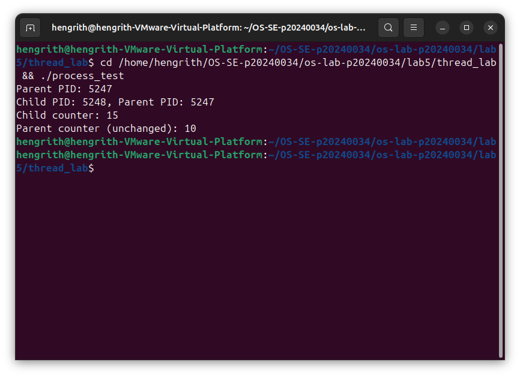
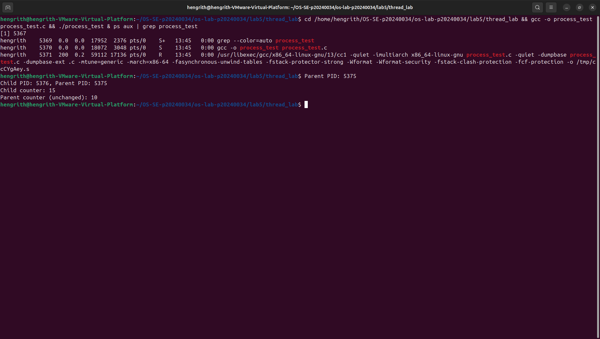
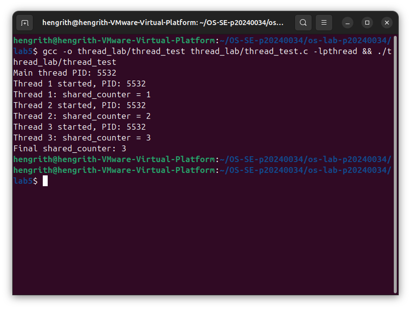
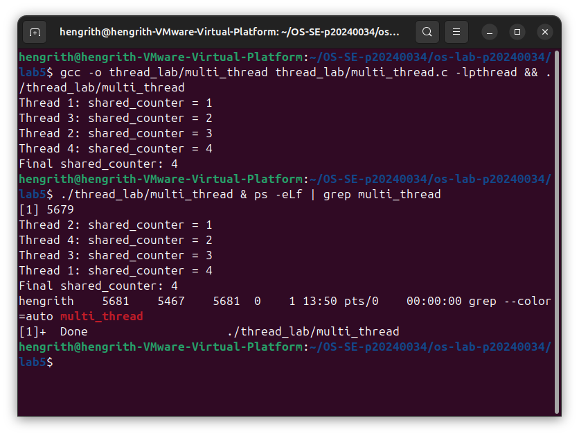
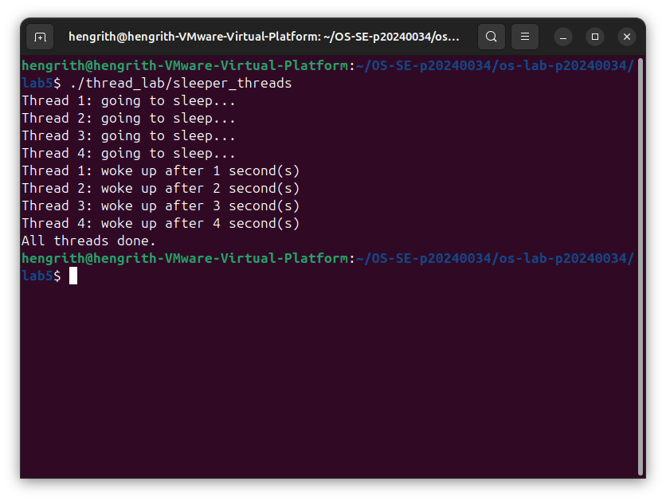
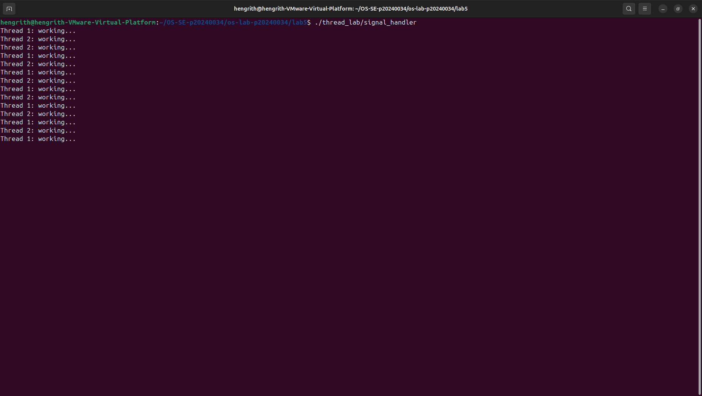
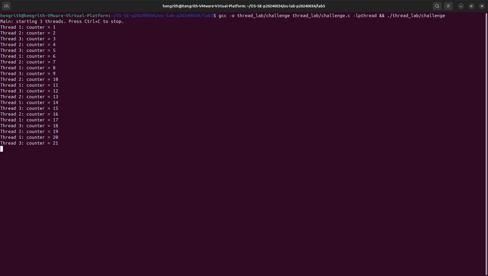

cat > README.md << 'EOF'
# OS Lab 5 Submission — Threads, Kernel Workers & Process Signals
- **Student Name:** LOR Hengrith
- **Student ID:** p20240034
---
## Task Output Source Files
Make sure all of the following files are present in your `lab5/thread_lab/` folder:
- [x] `process_test.c`
- [x] `thread_test.c`
- [x] `multi_thread.c`
- [x] `sleeper_threads.c`
- [x] `signal_handler.c`
- [x] `challenge.c`
---
## Screenshots
Insert your screenshots below.
### Screenshot 1 — Task 1: Process vs Thread (Process Test)
Show the output of `process_test.c`.

---
### Screenshot 2 — Task 1: Process vs Thread (Thread Test)
Show the output of `thread_test.c`.

---
### Screenshot 3 — Task 2: Thread Interaction
Show the output of `multi_thread.c`.

---
### Screenshot 4 — Task 3: Visualizing 1:1 Thread Mapping
Show the `ps -eLf` output or `/proc/[pid]/task/` directory visualizing the LWP mapping for user threads.

---
### Screenshot 5 — Task 3: `htop` Kernel Threads
Show `htop` visualizing kernel threads (usually bracketed names like `[kworker]`).

---
### Screenshot 6 — Task 4: Catching `SIGINT`
Show the output of your `signal_handler` program gracefully catching `Ctrl+C`.

---
### Screenshot 7 — Challenge: Graceful Multithreaded Shutdown
Show the output of your `challenge.c` program joining its threads and exiting gracefully after receiving `Ctrl+C`.

---
## Answers to Lab Questions
1. **Why do threads share memory while processes do not (by default)?**
> Threads exist within the same process and share the same virtual address space. Processes are independent — each gets its own copy of memory after `fork()`, so changes in one do not affect the other.

2. **Based on the 1:1 mapping, what is the role of an LWP (Lightweight Process) in Linux?**
> An LWP is the kernel-side entity that represents a user thread. In Linux's 1:1 model, each pthread maps directly to one LWP, so the kernel can schedule threads independently on separate CPU cores.

3. **Why is it restricted to send signals to kernel threads (e.g., `kthreadd` or `kworker`)?**
> Kernel threads run entirely in kernel space and are not designed to handle user-defined signals. Sending signals to them could destabilize the kernel since they have no user-space signal handlers.

4. **Why can't `SIGKILL` (kill -9) be caught by a signal handler?**
> `SIGKILL` is handled directly by the kernel and never delivered to the process's signal handler. This guarantees that a process can always be forcefully terminated regardless of its state.

---
## Reflection
> The most challenging part was managing shared state safely across threads — understanding when a mutex is needed and where race conditions can silently occur. These concepts apply directly to real systems: web servers like Nginx use worker threads to handle concurrent requests, and databases use mutexes and signal handling to ensure clean shutdowns without corrupting data.
EOF