# OS Lab 6 Submission — Linux Security, Users, Groups & File Permissions

- **Student Name:** LOR Hengrith
- **Student ID:** p20240034

---

## Task Output Files

Make sure all of the following files are present in your `lab6/` folder:

- [x] `task1_users.txt`
- [x] `task2_groups.txt`
- [x] `task3_permissions.txt`
- [x] `task3_stat_output.txt`
- [x] `task4_special_bits.txt`
- [x] `task5_acl.txt`
- [x] `security_lab/whoami_suid.c`

---

## Screenshots

### Screenshot 1 — Task 1: User Creation
Show `cat task1_users.txt` confirming both `dev_alice` and `dev_bob` accounts exist.
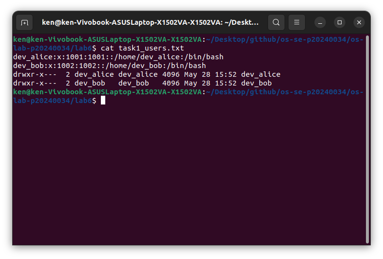

---

### Screenshot 2 — Task 1: User Modification
Show the updated `/etc/passwd` entry for `dev_alice` with the GECOS comment field.
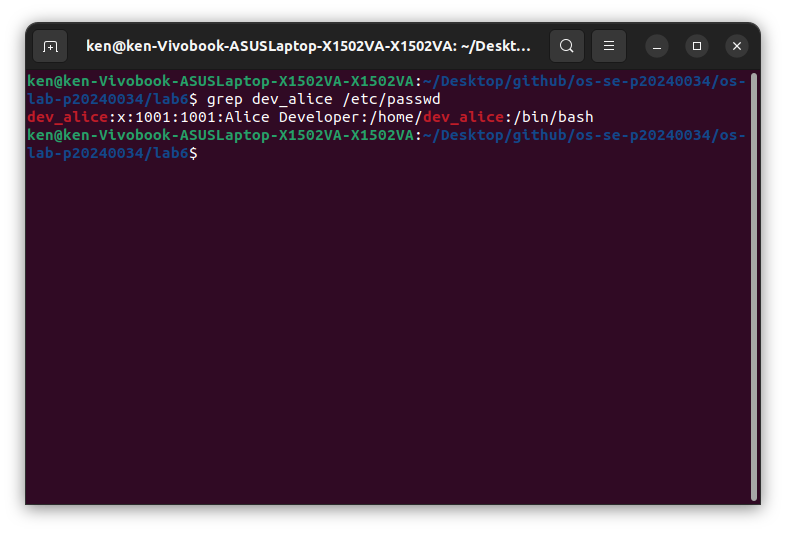

---

### Screenshot 3 — Task 2: Group Setup
Show `cat task2_groups.txt` with group membership for both users.
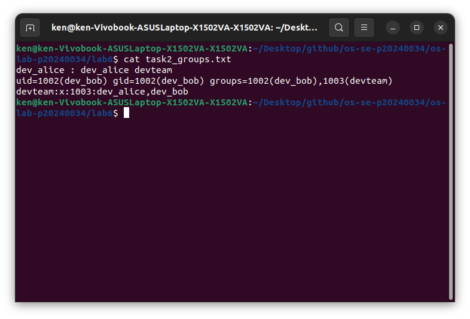

---

### Screenshot 4 — Task 2: Multiple Group Membership
Show `id dev_alice` confirming membership in both `devteam` and `auditors`.
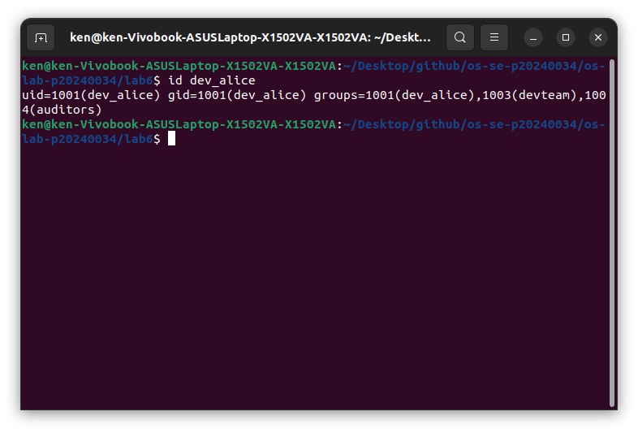

---

### Screenshot 5 — Task 3: Directory Permissions
Show `cat task3_permissions.txt` with `drwxrwx---` on the project directory.
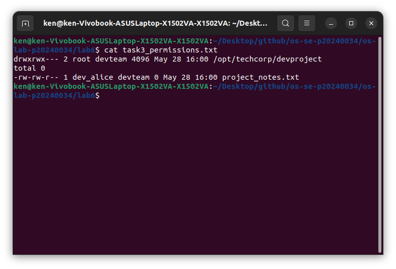

---

### Screenshot 6 — Task 3: Access Denied
Show the `Permission denied` error when `temp_user` tries to access the project directory.
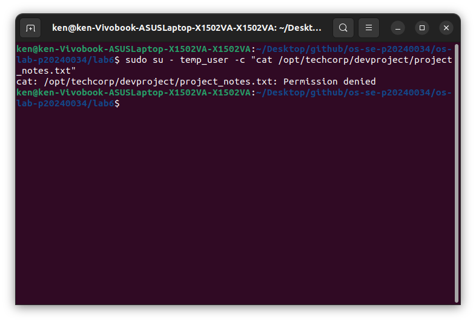

---

### Screenshot 7 — Task 4: setgid Bit
Show the directory listing with `s` in the group execute position, and `bob_file.txt` inheriting the `devteam` group.
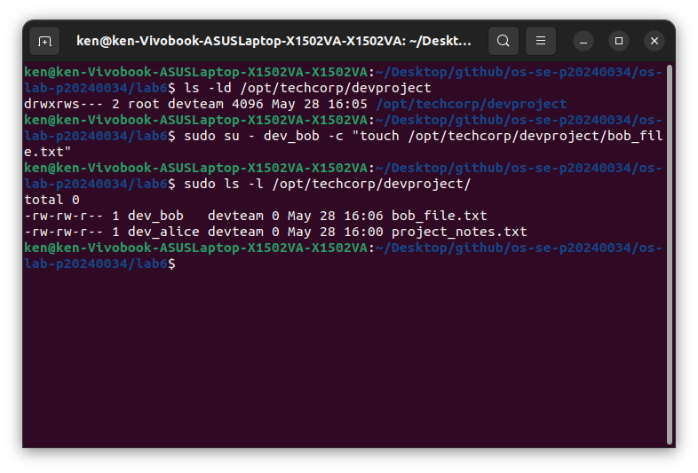

---

### Screenshot 8 — Task 4: Sticky Bit
Show the `t` bit in the directory listing and the `Operation not permitted` error when `dev_bob` tries to delete `dev_alice`'s file.
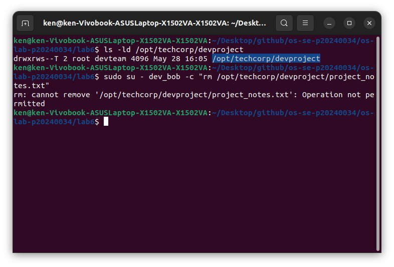

---

### Screenshot 9 — Task 4: setuid Bit
Show `ls -l whoami_suid` with `s` in the owner execute position and the program's UID output.
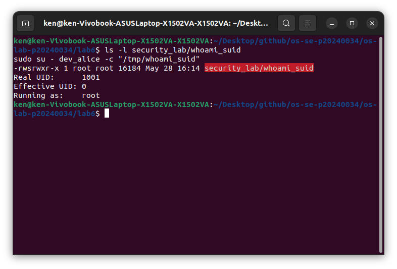

---

### Screenshot 10 — Task 5: ACL Directory
Show `getfacl /opt/techcorp/devproject` with the `auditors` ACE.
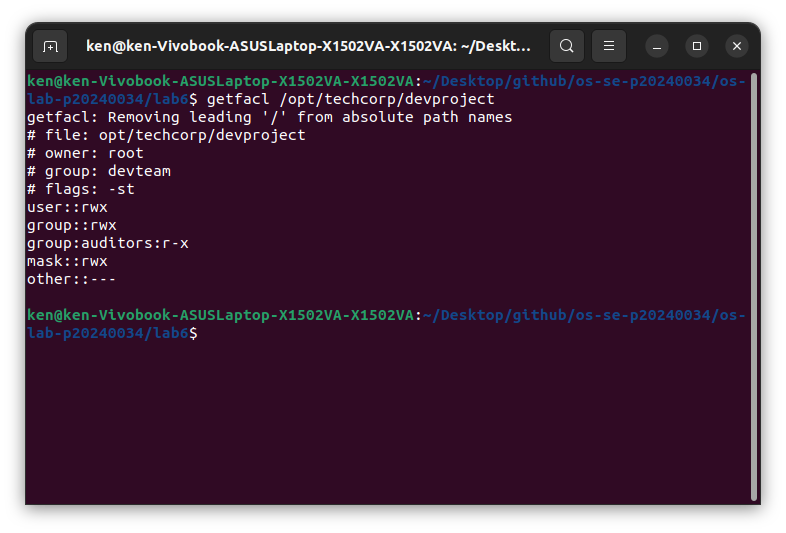

---

### Screenshot 11 — Task 5: ACL Access Test
Show `dev_alice` successfully accessing the file and `temp_user` being denied.
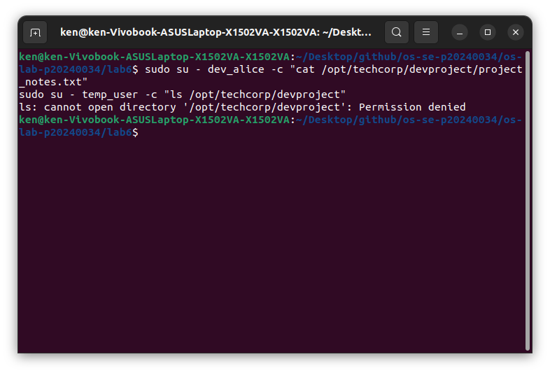

---

### Screenshot 12 — Task 5: ACL Output File
Show `cat task5_acl.txt` with the full ACL entries.
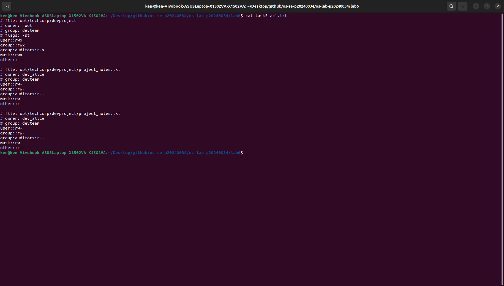

---

## Answers to Lab Questions

1. **What is the difference between `userdel` and `userdel -r`?**
   > `userdel` only deletes the user account, but leaves their home folder and files behind on the system. `userdel -r` deletes the account AND removes their home directory and all their files along with it. Use `-r` when you want a clean, complete removal.

2. **Why is it safer to use `visudo` instead of directly editing `/etc/sudoers`?**
   > `visudo` checks the file for syntax errors before saving it. If you make a typo editing `/etc/sudoers` directly, it can break sudo completely and lock everyone out of the system. `visudo` prevents that by warning you if something is wrong before any changes are applied.

3. **What happens when a `setgid` directory contains files created by different users? What benefit does this provide for team collaboration?**
   > Any file created inside a `setgid` directory automatically gets the directory's group, no matter who created it. So if both `dev_alice` and `dev_bob` create files in the shared folder, both files will belong to `devteam`. This means the whole team can access each other's files without having to manually fix permissions every time.

4. **What limitation of standard Unix permissions does the ACL system solve?**
   > Normal Unix permissions only let you assign one owner and one group to a file. So if you want to give a second group different access, you're stuck. ACLs fix this by letting you add extra permission rules for specific users or groups on top of the standard ones, without changing the original ownership.