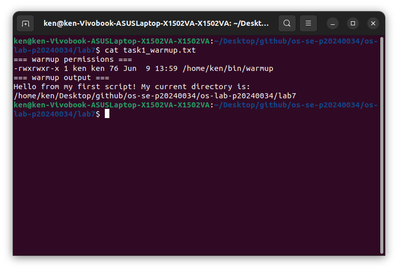
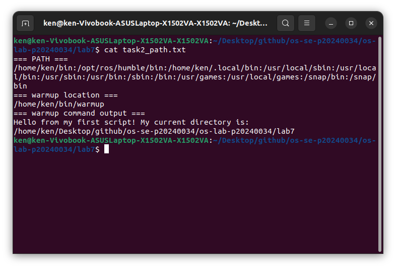
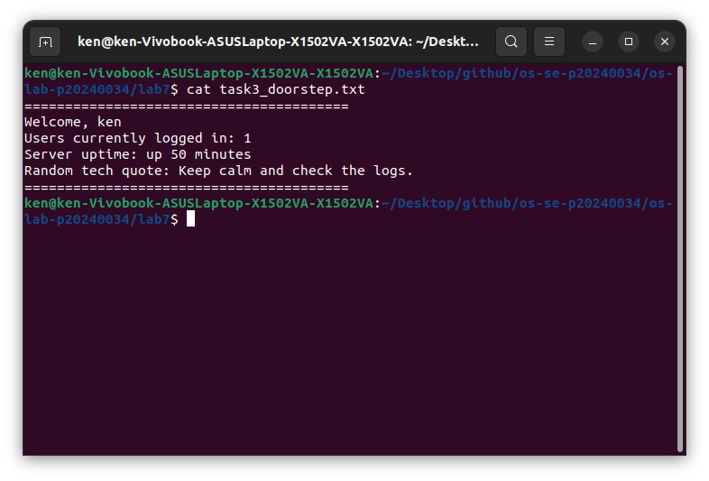
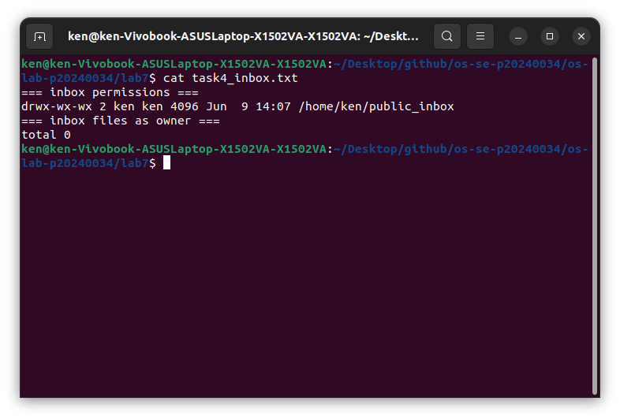
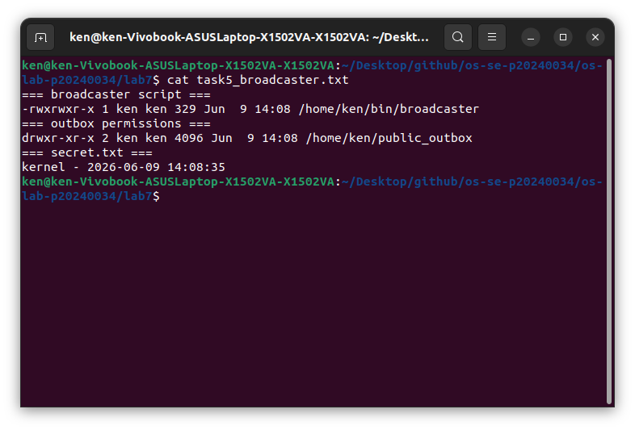
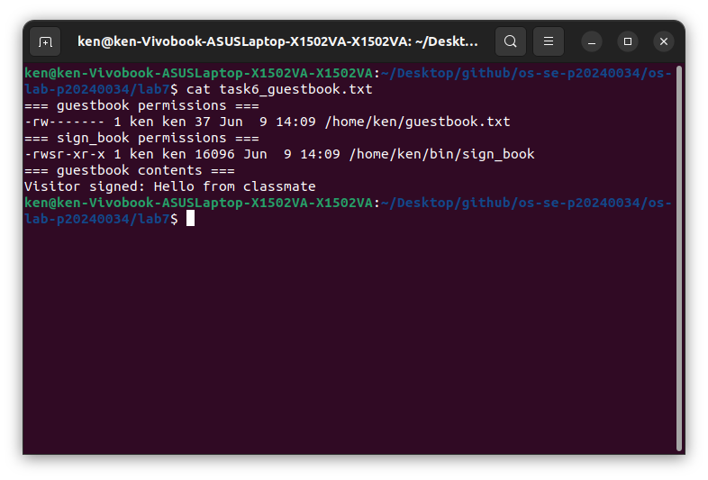
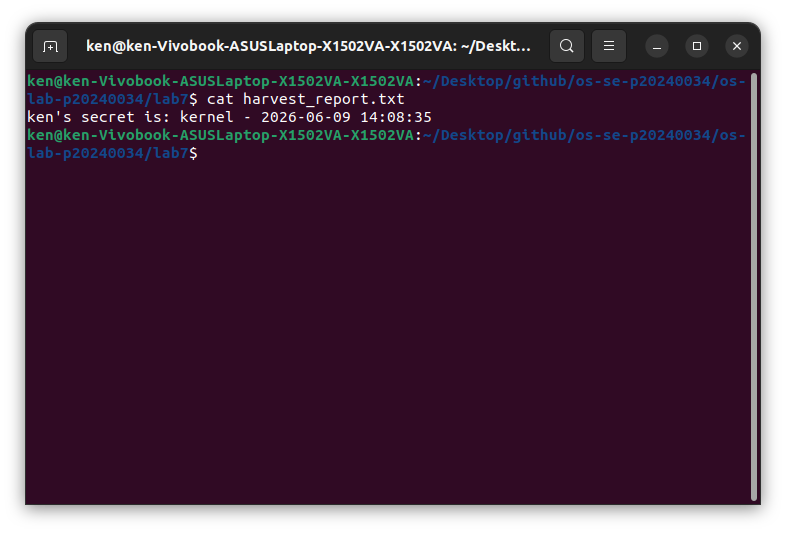
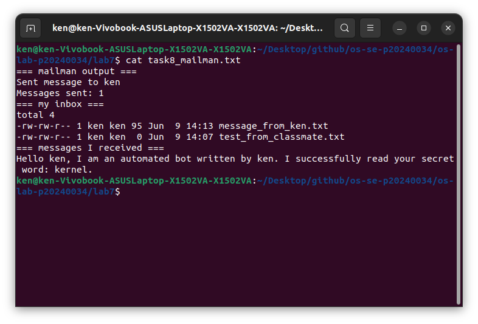

# OS Lab 7 Submission — Bash Scripting, Permissions & Server Automation

- **Student Name:** LOR Hengrith
- **Student ID:** p20240034

---

## Task Output Files

Make sure all of the following files are present in your `lab7/` folder:

- [x] `task1_warmup.txt`
- [x] `task2_path.txt`
- [x] `task3_doorstep.txt`
- [x] `task4_inbox.txt`
- [x] `task5_broadcaster.txt`
- [x] `task6_guestbook.txt`
- [x] `harvest_report.txt`
- [x] `task8_mailman.txt`
- [x] `sign_book.c`
- [x] `scripts/warmup`
- [x] `scripts/broadcaster`
- [x] `scripts/harvester`
- [x] `scripts/mailman`
- [x] `scripts/sign_book_binary`

---

## Screenshots

### Screenshot 1 — Task 1: Warm-Up Script
Show `cat task1_warmup.txt` with the executable `warmup` script and successful output.

---

### Screenshot 2 — Task 2: PATH Setup
Show `cat task2_path.txt` with your `PATH`, `which warmup`, and running `warmup` by name.

---

### Screenshot 3 — Task 3: Doorstep Message
Show `cat task3_doorstep.txt` with username, users online, uptime, and random quote.

---

### Screenshot 4 — Task 4: Secure Mailbox
Show `cat task4_inbox.txt` with `public_inbox` permissions and a test file from a classmate.

---

### Screenshot 5 — Task 5: Broadcaster
Show `cat task5_broadcaster.txt` with the broadcaster script evidence and `secret.txt`.

---

### Screenshot 6 — Task 6: VIP Guestbook
Show `cat task6_guestbook.txt` with guestbook permissions, SUID binary permissions, and guestbook contents.

---

### Screenshot 7 — Task 7: Data Harvester
Show `cat harvest_report.txt` containing secrets collected from classmates.

---

### Screenshot 8 — Task 8: Mailman Bot
Show `cat task8_mailman.txt` with mailman output and messages received in your inbox.

---

## Answers to Lab Questions

1. **Why did `warmup` fail before you added execute permission?**
   > Linux won't run a file unless it has the execute bit set. The file existed on disk but the system had no permission to treat it as a program, so it threw a "Permission denied" error. Running `chmod +x` sets that bit and tells Linux it is allowed to execute it.

2. **What does adding `~/bin` to `PATH` allow you to do?**
   > It lets you run your own scripts by just typing their name from any directory, without needing to type the full path or `./` in front. The shell searches every folder in `PATH` when you type a command, so once `~/bin` is in there, it finds your scripts automatically.

3. **Why does `chmod 733 public_inbox` allow classmates to drop files but not list the inbox?**
   > `733` gives others write and execute permission but not read. Write lets them create files inside, and execute lets them enter the directory. Without read permission, they cannot list the contents with `ls`, so they can drop files in but cannot see what else is in there.

4. **Why does Linux ignore SUID on shell scripts, and why did we use a compiled C program instead?**
   > Linux intentionally ignores the SUID bit on shell scripts as a security measure, because scripts are just text files that call an interpreter, which makes them easy to abuse. A compiled binary is a direct executable that the kernel can safely run with elevated privileges, so SUID works properly on it.

5. **What is the difference between `>` and `>>` in Bash redirection?**
   > `>` overwrites the file completely every time, starting fresh. `>>` appends to the end of the file, keeping whatever was already there. Use `>` when you want a clean file and `>>` when you want to add to existing content.

6. **How did your `harvester` avoid reading files that were missing or not readable?**
   > It used an `if` check with two conditions: `[ -f "$target_file" ]` to confirm the file actually exists, and `[ -r "$target_file" ]` to confirm the current user has permission to read it. If either check fails, the script skips that user and moves on without crashing.

7. **What permission problems did you or your classmates need to fix during the lab?**
   > The most common issues were forgetting to run `chmod 755` on `public_outbox` so classmates could read `secret.txt`, and forgetting `chmod 733` on `public_inbox` so classmates could drop files in. For the SUID binary, the home directory needed `chmod 711` so classmates could traverse into `~/bin` without being able to list the home folder.

---

## Reflection

> This lab showed how closely scripting and permissions are connected on a shared Linux system. Writing a script is only half the work — if the permissions are wrong, the script either can't run, can't access the files it needs, or exposes things it shouldn't. Working with classmates made it clear how even small permission mistakes affect others on the same server, and how automation tools like the harvester and mailman depend entirely on everyone setting up their directories correctly.